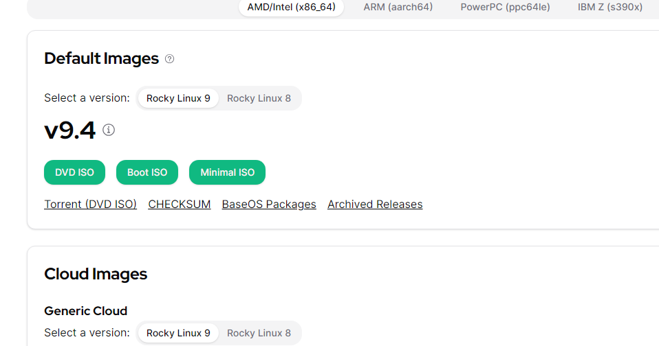
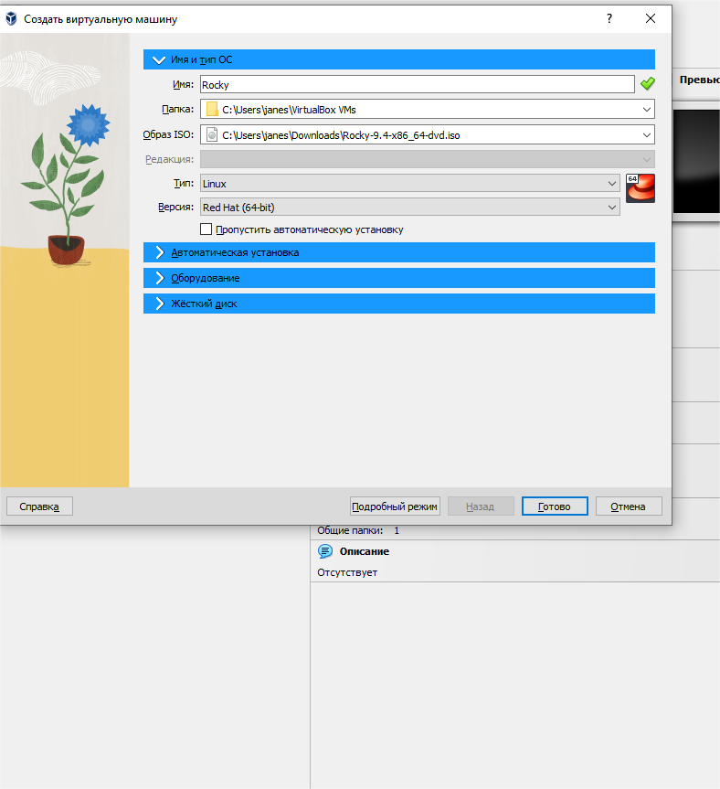
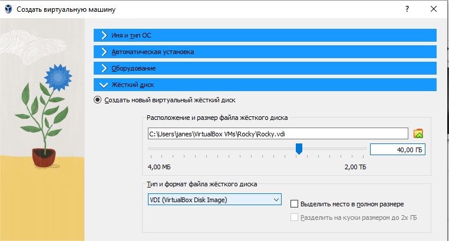
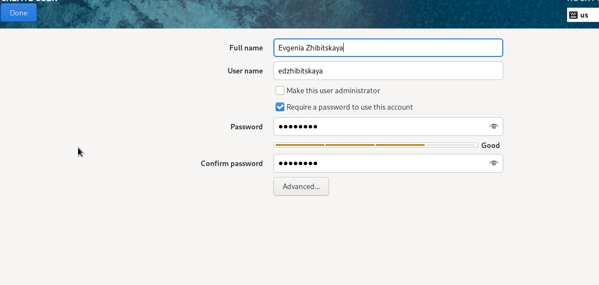
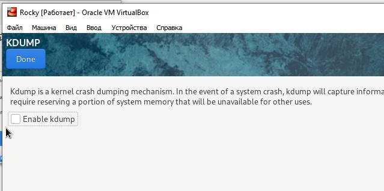
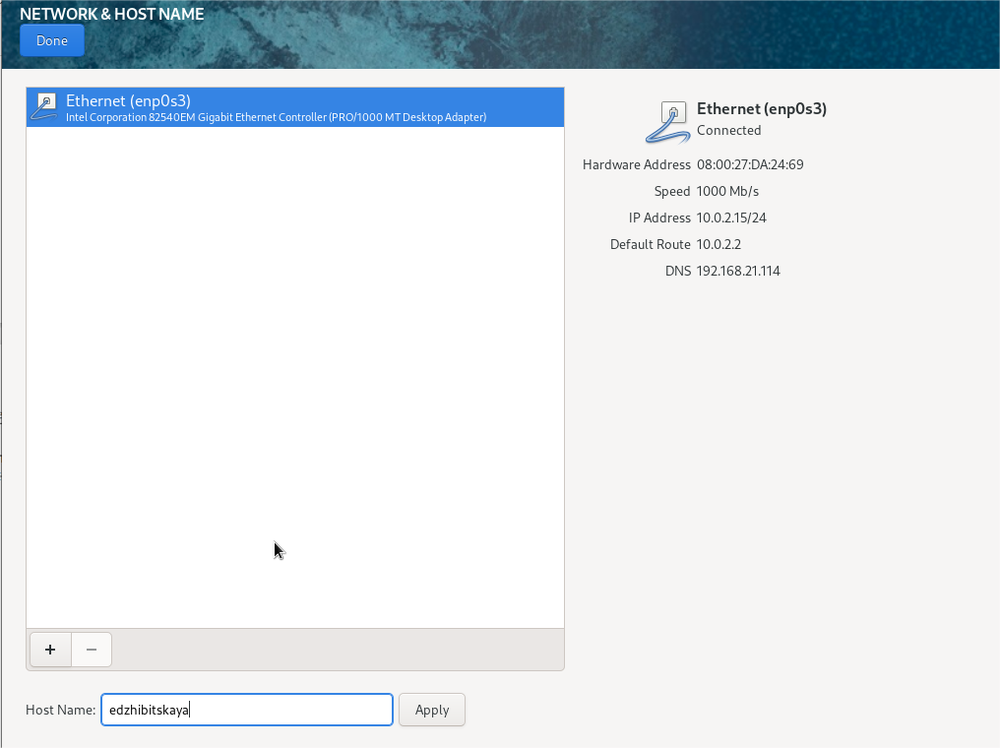
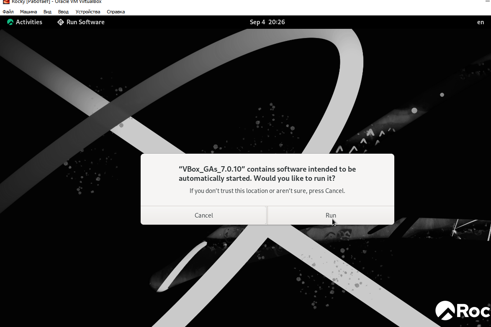
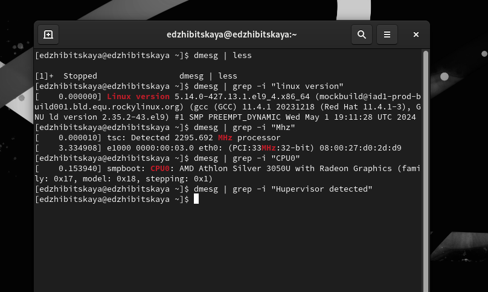
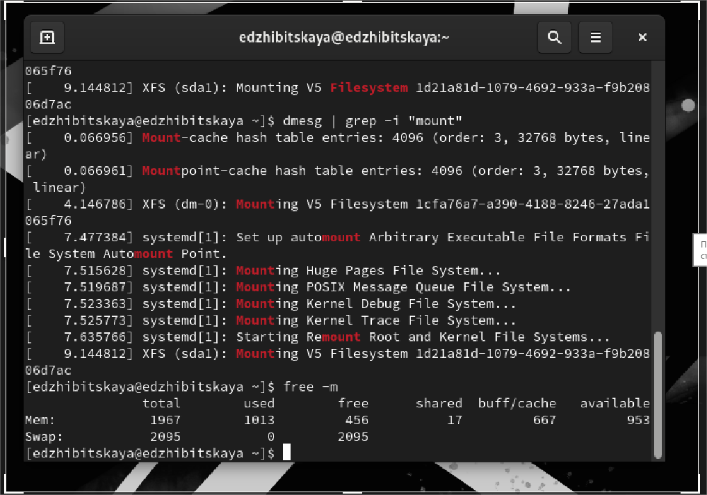

---
## Front matter
lang: ru-RU
title: Лабораторная работа №1
subtitle: Установка и конфигурация ОС на виртуальную машину
author:
  - Жибицкая Е.Д.
institute:
  - Российский университет дружбы народов, Москва, Россия

## i18n babel
babel-lang: russian
babel-otherlangs: english

## Formatting pdf
toc: false
toc-title: Содержание
slide_level: 2
aspectratio: 169
section-titles: true
theme: metropolis
header-includes:
 - \metroset{progressbar=frametitle,sectionpage=progressbar,numbering=fraction}
 - '\makeatletter'
 - '\beamer@ignorenonframefalse'
 - '\makeatother'
 
## Fonts
mainfont: PT Serif
romanfont: PT Serif
sansfont: PT Sans
monofont: PT Mono
mainfontoptions: Ligatures=TeX
romanfontoptions: Ligatures=TeX
sansfontoptions: Ligatures=TeX,Scale=MatchLowercase
monofontoptions: Scale=MatchLowercase,Scale=0.9
---

# Цель работы

## Цель работы

- Приобретение навыков установки ОС на виртуальную машину и настройки базовых сервисов.

# Выполнение работы

## Установка Rocky Linux

:::::::::::::: {.columns align=center}
::: {.column width="50%"}

:::
::::::::::::::

## Базовая настройка

:::::::::::::: {.columns align=center}
::: {.column width="40%"}

:::
::: {.column width="50%"}

:::
::::::::::::::

## Установка 
:::::::::::::: {.columns align=center}
::: {.column width="45%"}

:::
::: {.column width="50%"}

Выбор основного языка, настройка клавиатуры, имя пользователя и пароль для root
:::
::::::::::::::

## Установка

:::::::::::::: {.columns align=center}
::: {.column width="50%"}

:::
::: {.column width="50%"}

:::
::::::::::::::

## Подключение образа диска

:::::::::::::: {.columns align=center}
::: {.column width="50%"}

:::
::::::::::::::

## Выполнение задания. Изучение характеристик

:::::::::::::: {.columns align=center}
::: {.column width="50%"}

:::
::: {.column width="50%"}

:::
::::::::::::::

# Вывод

## Вывод

- В ходе работы была установлена машина Rocky Linux, проведена ее настройка, изучены различные ее характеристики.

