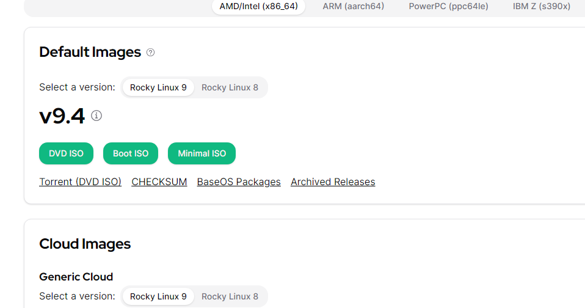
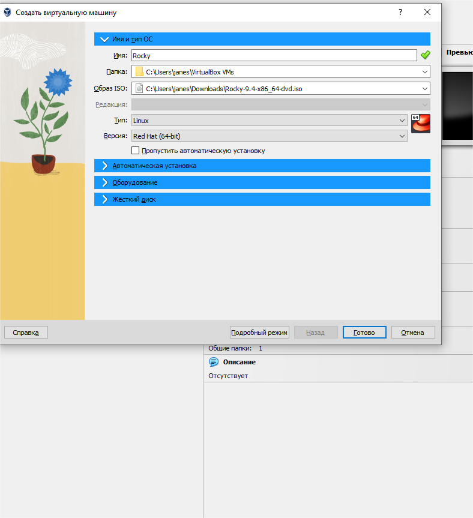
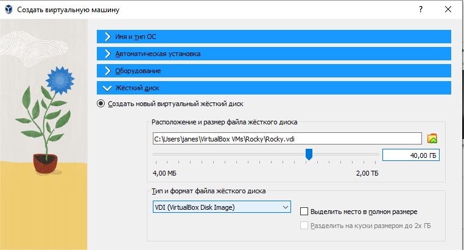
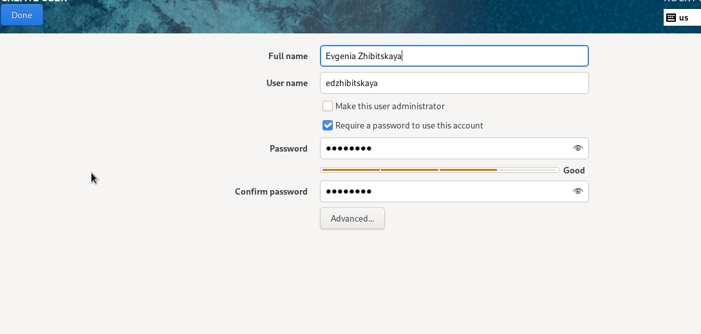
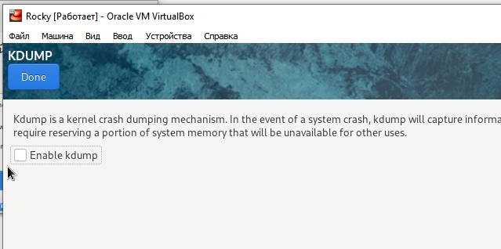
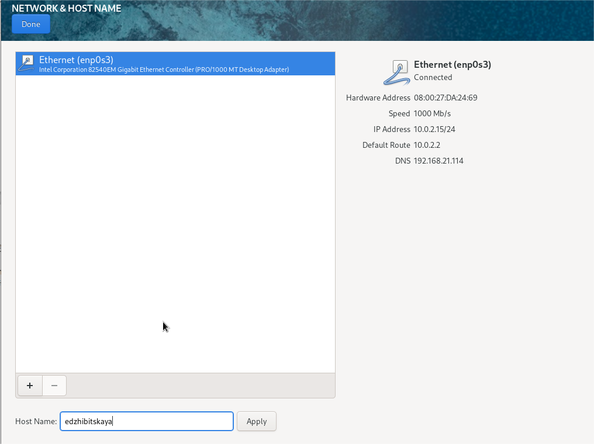
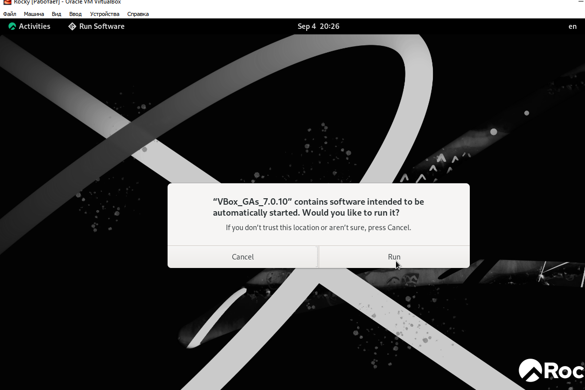
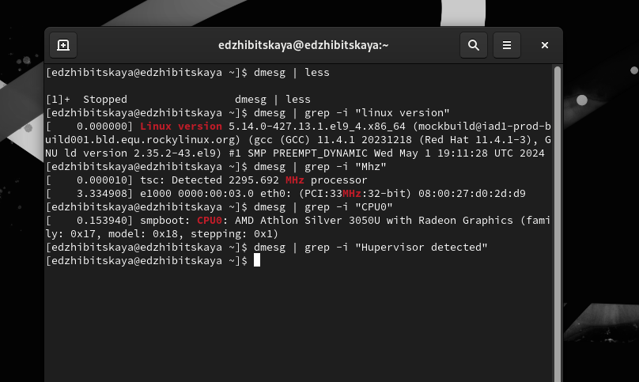
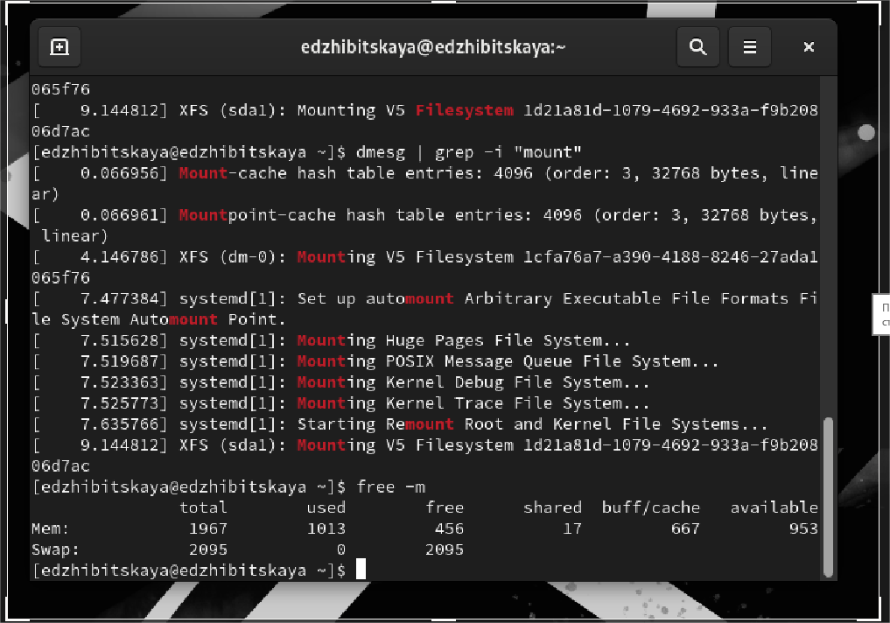

---
## Front matter
title: "Лабораторная работа №1"
subtitle: "Установка и конфигурация ОС"
author: "Жибицкая Евгения Дмитриевна"

## Generic otions
lang: ru-RU
toc-title: "Содержание"

## Bibliography
bibliography: bib/cite.bib
csl: pandoc/csl/gost-r-7-0-5-2008-numeric.csl

## Pdf output format
toc: true # Table of contents
toc-depth: 2
lof: true # List of figures
lot: true # List of tables
fontsize: 12pt
linestretch: 1.5
papersize: a4
documentclass: scrreprt
## I18n polyglossia
polyglossia-lang:
  name: russian
  options:
	- spelling=modern
	- babelshorthands=true
polyglossia-otherlangs:
  name: english
## I18n babel
babel-lang: russian
babel-otherlangs: english
## Fonts
mainfont: PT Serif
romanfont: PT Serif
sansfont: PT Sans
monofont: PT Mono
mainfontoptions: Ligatures=TeX
romanfontoptions: Ligatures=TeX
sansfontoptions: Ligatures=TeX,Scale=MatchLowercase
monofontoptions: Scale=MatchLowercase,Scale=0.9
## Biblatex
biblatex: true
biblio-style: "gost-numeric"
biblatexoptions:
  - parentracker=true
  - backend=biber
  - hyperref=auto
  - language=auto
  - autolang=other*
  - citestyle=gost-numeric
## Pandoc-crossref LaTeX customization
figureTitle: "Рис."
tableTitle: "Таблица"
listingTitle: "Листинг"
lofTitle: "Список иллюстраций"
lotTitle: "Список таблиц"
lolTitle: "Листинги"
## Misc options
indent: true
header-includes:
  - \usepackage{indentfirst}
  - \usepackage{float} # keep figures where there are in the text
  - \floatplacement{figure}{H} # keep figures where there are in the text
---

# Цель работы

Приобретение навыков установки ОС на виртуальную машину  и настройки сервисов.

# Выполнение лабораторной работы

Предварительно установим необходимую версию rocky linux на наш компьютер(рис. [-@fig:001]).

{#fig:001 width=70%}

Далее запустим Virtual box и начнем создавать новую машину. Для этого укажем название, подключим установленный образ диска и нажмем пропустить автоматическую установку(рис. [-@fig:002]).

{#fig:002 width=70%}

Создадим жесткий диск, выделив под него 40гб памяти(рис. [-@fig:003]). Кроме того сделаем 2 процессора и выделим 2048мб основной памяти.

{#fig:003 width=70%}

После запустим созданную нами виртуальную машину, выберем английский как основной язык, добавим также русский, как дополнительный.

Установим пароль для root, дав также разрешение на его ввод при использовании ssh. Зададим имя пользователя, пароль (рис. [-@fig:004]).

{#fig:004 width=70%}

Затем отключим KDUMP и установим сеть и имя узла. Место установки оставим без изменения(рис. [-@fig:005]) и (рис. [-@fig:006]).

{#fig:005 width=70%}

{#fig:006 width=70%}

После указания всех параметров перезапустим систему и завершим установку ОС.

Остается подключить образ диска, еще раз перезапустить систему (рис. [-@fig:007]).

{#fig:007 width=70%}

Переходим к выполнению задания. Используя команду gresp и фильтр изучим различные характеристики машины(рис. [-@fig:008]) и (рис. [-@fig:009]).

{#fig:008 width=70%}

{#fig:009 width=70%}

1. Версия ядра Linux (Linux version)
5.14.0-427.13.1.el9_4.x86_64

2. Частота процессора (Detected Mhz processor)
2295.692 

3. Модель процессора (CPU0)
AMD Athlon Silver 3050U With Radeon Graphics

4. Объем доступной оперативной памяти (Memory available)
456/2095

5. Тип обнаруженного гипервизора (Hypervisor detected).
6. Тип файловой системы корневого раздела.
7. Последовательность монтирования файловых систем
- 5, 6, 7 - на скриншоте

# Контрольные вопросы
1. Команды терминала
- Для получения справки по команде:
  - man <команда> 
    - Пример: man ls 
  - <команда> --help 
    - Пример: ls --help.

- Для перемещения по файловой системе:
  - cd <путь>
    - Пример: cd /home/user/Documents.

- Для просмотра содержимого каталога:
  - ls 
    - Пример: ls -l — подробный список (с правами, владельцем и размерами).

- Для определения объёма каталога:
  - du -sh <каталог> 
    - Пример: du -sh /home/user/Documents.
- Для создания / удаления каталогов / файлов:
  - mkdir <каталог>
    - Пример: mkdir new_folder.
  - rm <файл> 
    - Пример: rm old_file.txt. 
  - rmdir <каталог> 
    - Пример: rmdir empty_folder.

- Для задания определённых прав на файл / каталог:
  - chmod <права> <файл/каталог>
    - Пример: chmod 755 script.sh.

- Для просмотра истории команд:
  - history — выводит список ранее выполненных команд.
    - Пример: history | grep ls — ищет команды, содержащие ls.

2. Информация о пользователе

- Имя пользователя (login name).
- UID (идентификатор пользователя).
- GID (идентификатор группы).
- Полное имя (или комментарий).
- Домашний каталог.
- Шелл (интерпретатор командной строки).

Команды для просмотра информации о пользователе:
- whoami — выводит имя текущего пользователя.
- id — показывает UID и GID пользователя.
- finger <пользователь> — отображает детальную информацию о пользователе (при наличии).
- getent passwd <пользователь> — показывает записи о пользователе из базы данных.

3. Файловая система

Файловая система — это способ организации и хранения файлов на накопителе (например, жестком диске, SSD) вместе со структурами, которые позволяют пользователям и компьютерам находить и управлять этими файлами.

Примеры:
- FAT32 — старая файловая система, поддерживающая большие объемы совместимости, но имеет ограничения по размеру файла (до 4 ГБ).

- ext4 — современная файловая система для Linux с поддержкой больших объемов и высокой производительностью.

4. Как посмотреть, какие файловые системы подмонтированы в ОС?

Чтобы посмотреть, какие файловые системы подмонтированы в операционной системе, используется команда mount

5. Как удалить зависший процесс

Чтобы удалить зависший процесс, использутся команда kill. Сначала найдите PID (идентификатор процесса) зависшего процесса с помощью:

kill <PID>

kill -9 <PID>

# Выводы

В ходе работы была установлена машина Rocky Linux, проведена ее настройка, изучены различные ее характеристики.

# Литература

[Туис](https://esystem.rudn.ru/pluginfile.php/2400671/mod_resource/content/7/002-os_install-Rocky9.pdf)

