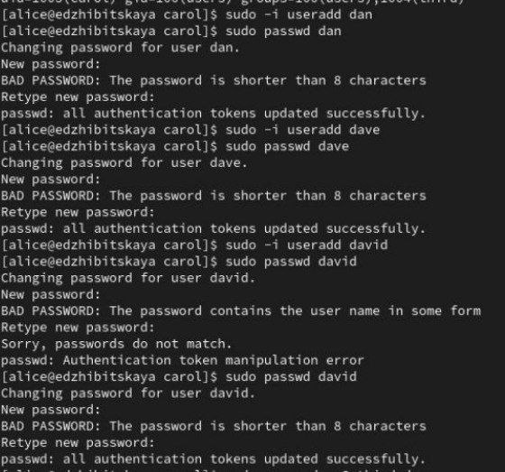

---
## Front matter
lang: ru-RU
title: Лабораторная работа №2
subtitle: Управление пользователями и группами
author:
  - Жибицкая Е.Д.
institute:
  - Российский университет дружбы народов, Москва, Россия

## i18n babel
babel-lang: russian
babel-otherlangs: english

## Formatting pdf
toc: false
toc-title: Содержание
slide_level: 2
aspectratio: 169
section-titles: true
theme: metropolis
header-includes:
 - \metroset{progressbar=frametitle,sectionpage=progressbar,numbering=fraction}
 - '\makeatletter'
 - '\beamer@ignorenonframefalse'
 - '\makeatother'
 
## Fonts
mainfont: PT Serif
romanfont: PT Serif
sansfont: PT Sans
monofont: PT Mono
mainfontoptions: Ligatures=TeX
romanfontoptions: Ligatures=TeX
sansfontoptions: Ligatures=TeX,Scale=MatchLowercase
monofontoptions: Scale=MatchLowercase,Scale=0.9
---

# Цель работы

## Цель работы

- Продолжение изучения Linux. Приобретение навыков по работе с учетными записями пользователей и группами пользователей данной ОС.

# Выполнение работы

## Изучение команд с помощью man

:::::::::::::: {.columns align=center}
::: {.column width="50%"}

:::
::::::::::::::

## 2.4.1. Переключение учетных записей

:::::::::::::: {.columns align=center}
::: {.column width="40%"}

:::
::: {.column width="50%"}
В терминале командами whoami и id получаем информацию о пользователе.
Команда whoami показывает только имя пользователя, команда id - имя и идентификатор пользователя, имя и идентификатор основной группы и, при наличие, дополнительных групп
:::
::::::::::::::

## 2.4.1
:::::::::::::: {.columns align=center}
::: {.column width="40%"}

:::
::: {.column width="50%"}

строка %wheel ALL=(ALL) ALL

:::
::::::::::::::

## 2.4.1

:::::::::::::: {.columns align=center}
::: {.column width="50%"}

:::
::::::::::::::

## 2.4.1

:::::::::::::: {.columns align=center}
::: {.column width="50%"}

:::
::::::::::::::

## 2.4.2. Создание учетных записей

:::::::::::::: {.columns align=center}
::: {.column width="50%"}

:::
::: {.column width="50%"}
Переключимся на суперпользователя, откроем файл конфигурации и изменим несколько параметров. Сразу создадим в каталоге /etc/skel подкаталоги Pictures и Documents.

:::
::::::::::::::

## 2.4.2

:::::::::::::: {.columns align=center}
::: {.column width="50%"}

:::
::: {.column width="45%"}

:::
::::::::::::::

## 2.4.2

:::::::::::::: {.columns align=center}
::: {.column width="50%"}

:::
::: {.column width="50%"}
Добавляем строку export EDITOR=/usr/bin/vim.

Эта запись означает, что текстовый редактор vim  будет установлен по умолчанию для инструментов, которые нуждаются в изменении текстовых.

:::
::::::::::::::

## 2.4.2

:::::::::::::: {.columns align=center}
::: {.column width="50%"}

:::
::::::::::::::

## 2.4.2 

:::::::::::::: {.columns align=center}
::: {.column width="50%"}

:::
::: {.column width="50%"}
Изучим запись о пароле этого пользователя. 
Изменим эти параметры
Теперь срок действия пароля истекает через 90 дней (-x 90). За три дня до истечения срока действия пользователь получит предупреждение (-w 3). Пароль должен использоваться как минимум за 30 дней (-n 30) до того, как его можно будет
изменить.

:::
::::::::::::::

## 2.4.2

:::::::::::::: {.columns align=center}
::: {.column width="50%"}

:::
::: {.column width="50%"}
Используя команду sudo cat /etc/shadow | grep carol, мы убедимся, что данные изменились. Также проверим, что идентификатор alice существует во всех трёх файлах:
grep alice /etc/passwd /etc/shadow /etc/group, а идентификатор carol существует не во всех трёх файлах:
sudo grep carol /etc/passwd /etc/shadow /etc/group
:::
::::::::::::::

## 2.4.3. Работа с группами

:::::::::::::: {.columns align=center}
::: {.column width="50%"}
Перейдем в запись Alice, создадим две группы - main и third, добавим туда Alice и Bob. В группу third добавим Carol, проверим информацию о ней(она входит в группы users(основная) и third(второстепенная)
::: 
::: {.column width="50%"}

:::
::::::::::::::

## 2.4.3

:::::::::::::: {.columns align=center}
::: {.column width="40%"}

:::
::: {.column width="45%"}

:::
::::::::::::::

# Вывод

## Вывод

- В ходе работы были приобретены навыки по работе с пользователями, их учетными записями и группами. Проделаны различные действия по работе с ними. 

