---
## Front matter
title: "Лабораторная работа №2"
subtitle: "Дисциплина: Оcновы администрирования операционных систем"
author: "Жибицкая Евгения Дмитриевна"

## Generic otions
lang: ru-RU
toc-title: "Содержание"

## Bibliography
bibliography: bib/cite.bib
csl: pandoc/csl/gost-r-7-0-5-2008-numeric.csl

## Pdf output format
toc: true # Table of contents
toc-depth: 2
lof: true # List of figures
lot: true # List of tables
fontsize: 12pt
linestretch: 1.5
papersize: a4
documentclass: scrreprt
## I18n polyglossia
polyglossia-lang:
  name: russian
  options:
	- spelling=modern
	- babelshorthands=true
polyglossia-otherlangs:
  name: english
## I18n babel
babel-lang: russian
babel-otherlangs: english
## Fonts
mainfont: PT Serif
romanfont: PT Serif
sansfont: PT Sans
monofont: PT Mono
mainfontoptions: Ligatures=TeX
romanfontoptions: Ligatures=TeX
sansfontoptions: Ligatures=TeX,Scale=MatchLowercase
monofontoptions: Scale=MatchLowercase,Scale=0.9
## Biblatex
biblatex: true
biblio-style: "gost-numeric"
biblatexoptions:
  - parentracker=true
  - backend=biber
  - hyperref=auto
  - language=auto
  - autolang=other*
  - citestyle=gost-numeric
## Pandoc-crossref LaTeX customization
figureTitle: "Рис."
tableTitle: "Таблица"
listingTitle: "Листинг"
lofTitle: "Список иллюстраций"
lotTitle: "Список таблиц"
lolTitle: "Листинги"
## Misc options
indent: true
header-includes:
  - \usepackage{indentfirst}
  - \usepackage{float} # keep figures where there are in the text
  - \floatplacement{figure}{H} # keep figures where there are in the text
---

# Цель работы

Продолжение изучения Linux. Приобретение навыков по работе с учетными записями пользователей и группами пользователей данной ОС.

# Выполнение лабораторной работы

Первое задание - это ознакомиться с различными командами и узнать принцип их работы. Для этого используем команду man(рис. [-@fig:001]).

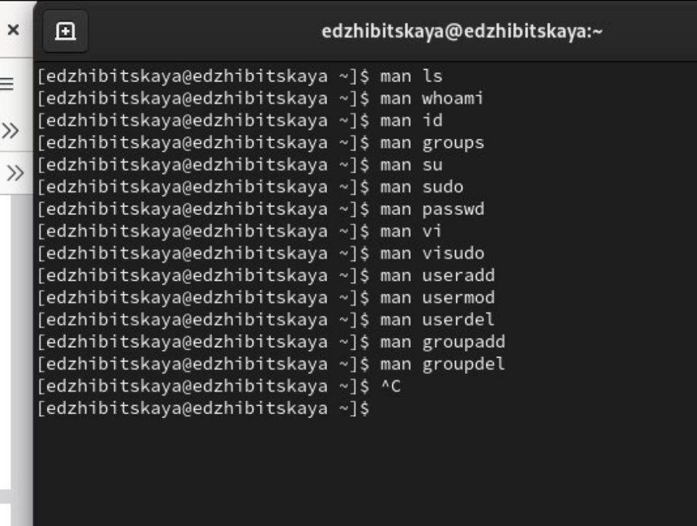{#fig:001 width=70%}

Далее переходим к непосредственному выполнению работы. Открываем раздел 2.4.1 и следуем инструкции.

В терминале командами whoami и id получаем информацию о пользователе.
Команда whoami показывает только имя пользователя, команда id - имя и идентификатор пользователя, имя и идентификатор основной группы и, при наличие, дополнительных групп(рис. [-@fig:002]).

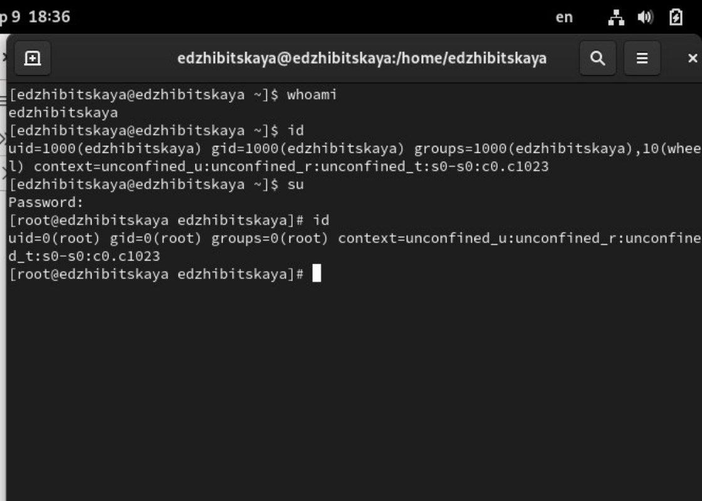{#fig:002 width=70%}

Возвращаемся к своей учетной записи и открываем файл sudoers с помощью visudo, проверяем, что там присутсвует строка %wheel ALL=(ALL) ALL. Wheel в данном случае означает тоже самое, что и root, то есть суперпользователь.

Также, использование именно этого редактора важно, так как он проверяет синтаксис и, соответственно предотвращаетт появление ошибок(рис. [-@fig:004]).

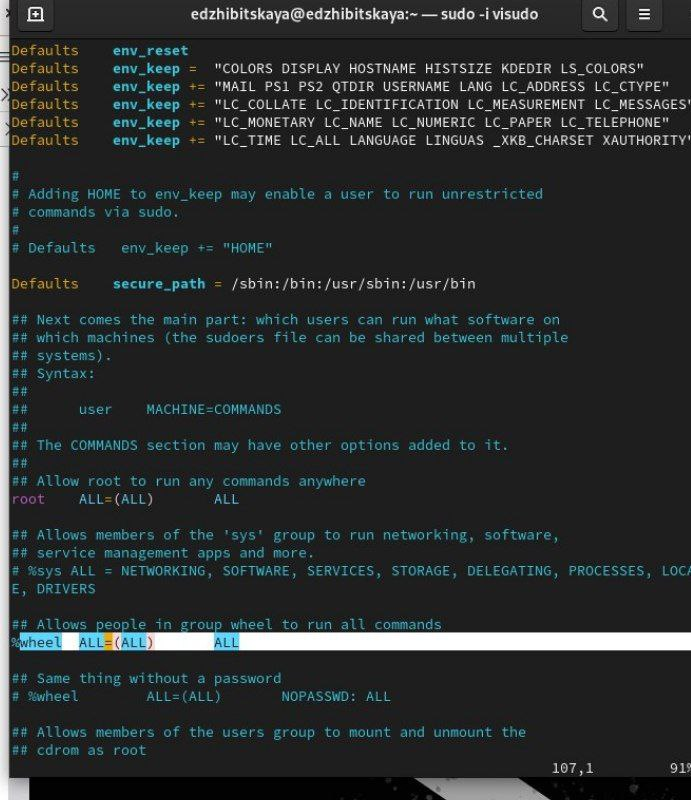{#fig:004 width=70%}

Перейдем к созданию пользователя Alice. Также убедимся в том, что пользователь был добавлен в группу wheel  и зададим пароль(рис. [-@fig:003]).

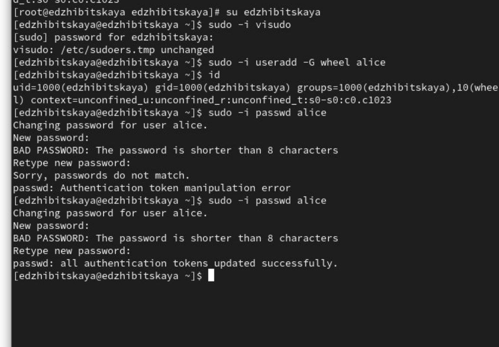{#fig:003 width=70%}

Переключимся на созданную учетную запись и добавим пользователя Bob, установим пароль и посмотрим в какие группы этот пользователь входит(рис. [-@fig:005]).

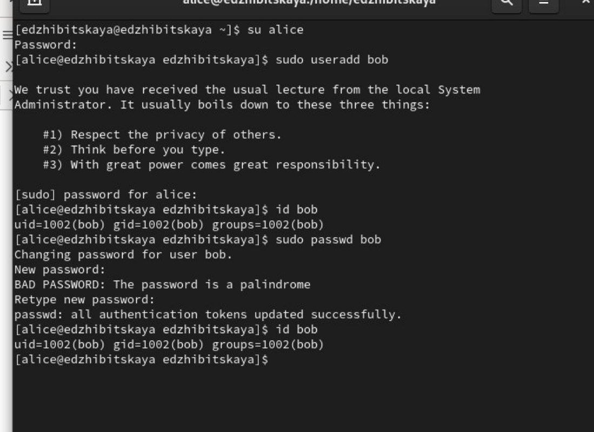{#fig:005 width=70%}

После этого переходим к разделу 2.4.2
Для этого переключимся на суперпользователя, откроем файл конфигурации(рис. [-@fig:006]) и изменим несколько параметров
(рис. [-@fig:007]) и (рис. [-@fig:008]). Сразу создадим в каталоге /etc/skel подкаталоги Pictures и Documents.

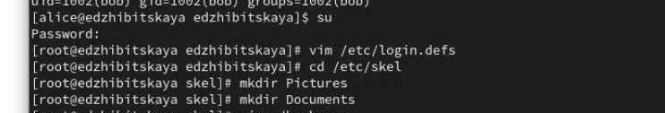{#fig:006 width=70%}

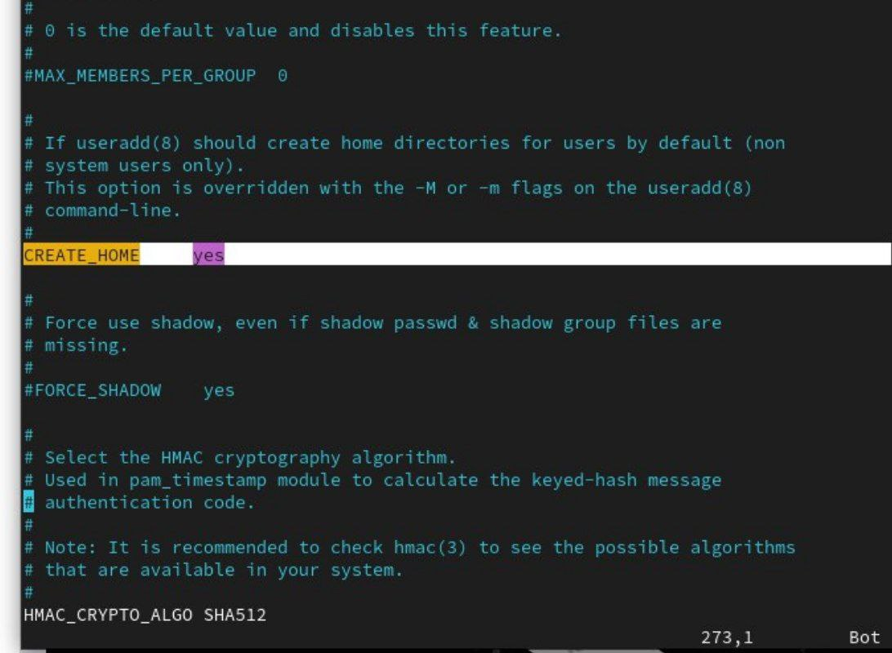{#fig:007 width=70%}

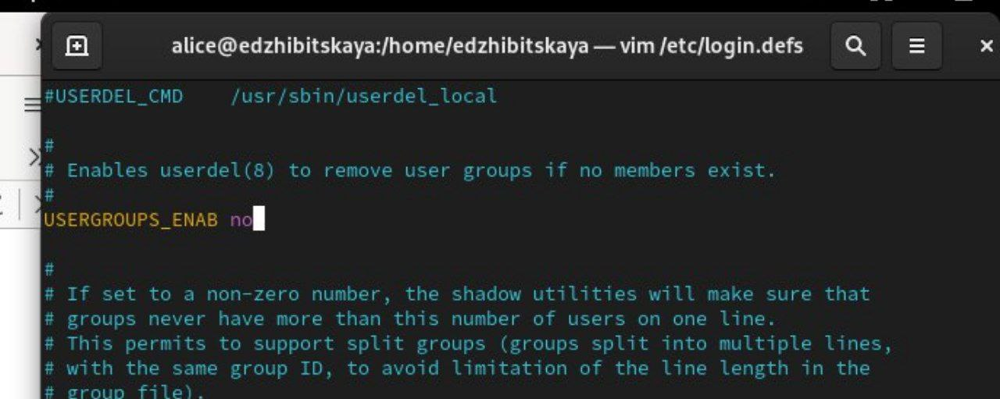{#fig:008 width=70%}

Далее открываем в редакторе vim файл .bashrc и добавляем строку export EDITOR=/usr/bin/vim (рис. [-@fig:009]).

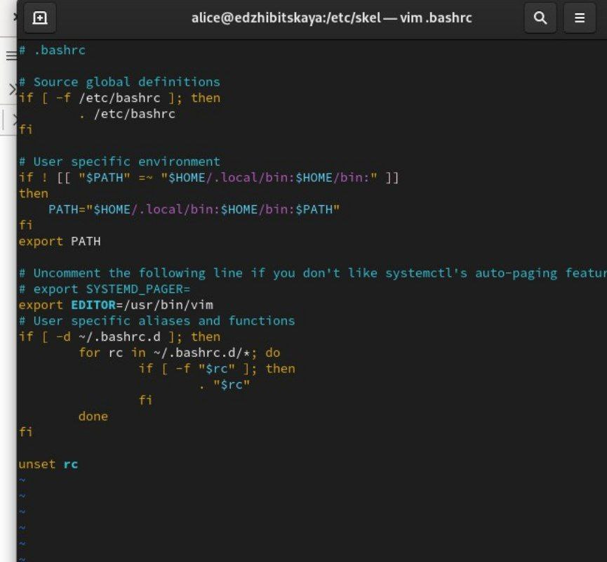{#fig:009 width=70%}

Возвращаемся к записи Alice и создаем Carol, добавляем пароль, знакомимся с id и убеждаемся, что созданные ранее каталоги там отображаются.(рис. [-@fig:010]).
Как можно заметить, Carol входит в группу users, имеет идентификатор 1003 и в домашнем каталоге содержатся необходимые подкаталоги.

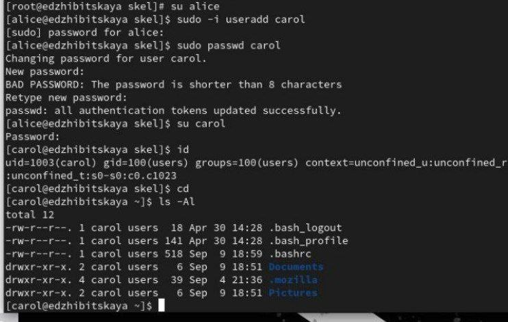{#fig:010 width=70%}

Также изучим запись о пароле этого пользователя. В ней видна информация о количестве дней с последнего изменения(1.01.1970) -19975, 9999дней максимального срока действия и 7 дней - предупреждение о необходимости смены пароля.(рис. [-@fig:011]).

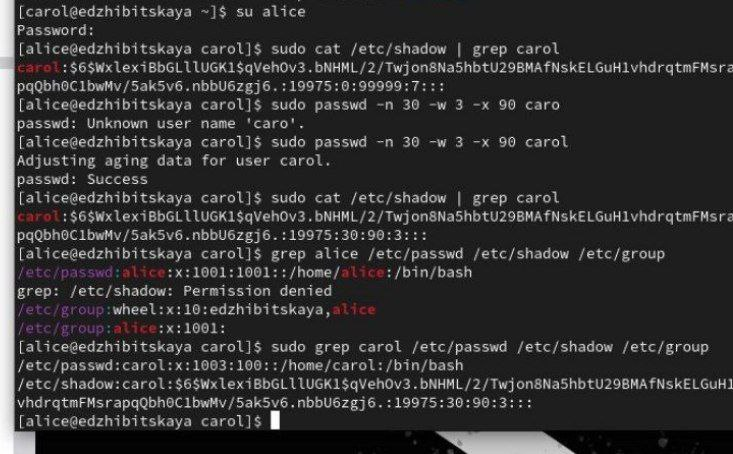{#fig:011 width=70%}

Изменим эти параметры: sudo passwd -n 30 -w 3 -x 90 carol
В этой записи срок действия пароля истекает через 90 дней (-x 90). За три дня до
истечения срока действия пользователь получит предупреждение (-w 3). Пароль должен использоваться как минимум за 30 дней (-n 30) до того, как его можно будет
изменить.

Используя команду sudo cat /etc/shadow | grep carol, мы убедимся, что данные изменились. Также проверим, что идентификатор alice существует во всех трёх файлах:
grep alice /etc/passwd /etc/shadow /etc/group, а идентификатор carol существует не во всех трёх файлах:
sudo grep carol /etc/passwd /etc/shadow /etc/group (рис. [-@fig:012]).

{#fig:012 width=70%}

Наконец перейдем к разделу 2.4.3 - работа с группами.
Перейдем в запись Alice, создадим две группы - main и third, добавим туда Alice и Bob. В группу third добавим Carol, проверим информацию о ней(она входит в группы users(основная) и third(второстепенная) (рис. [-@fig:013]).

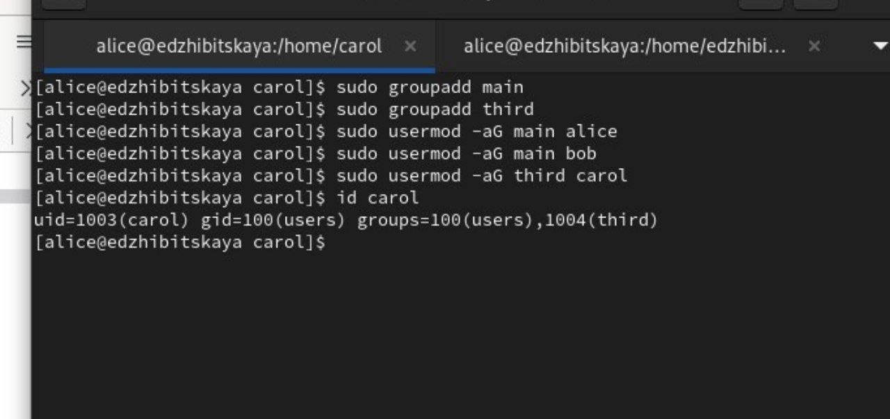{#fig:013 width=70%}

Также создадим еще 3х пользователей(рис. [-@fig:014]). и добавим их в группу (рис. [-@fig:015]). Все новые пользователи принадлежат группе users, а также third. 

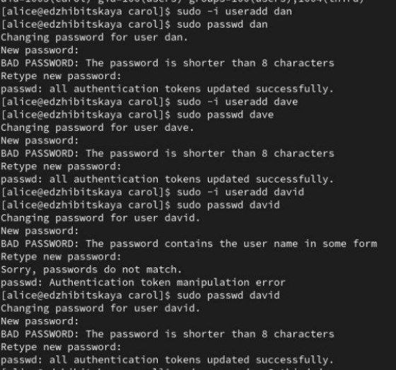{#fig:014 width=70%}

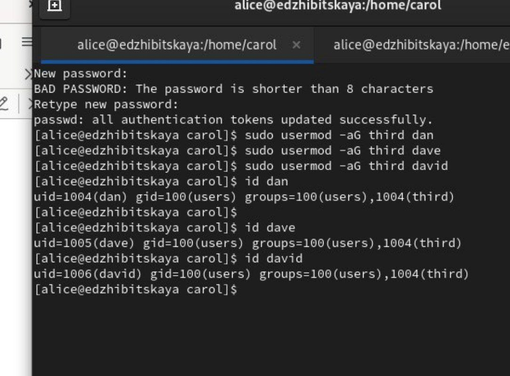{#fig:015 width=70%}

# Ответы на контрольные вопросы

1. Для получения информации о номере (UID) пользователя Linux и группах, в которые он включён, можно использовать команды:
   - id <имя_пользователя> — выводит UID, GID и группы пользователя.
   - groups <имя_пользователя> — отображает все группы, в которые входит пользователь.

2. Пользователь root имеет UID 0. Чтобы узнать его UID  можно использовать команду id root.

Пример вывода: uid=0(root) gid=0(root) группы=0(root)
     

3. Различие между командами su и sudo:
   - su  позволяет переключиться на другого пользователя, часто на root, и требует ввода пароля этого пользователя.
   - sudo позволяет выполнять команды от имени другого пользователя (обычно root), используя пароль текущего пользователя, и требует, чтобы пользователь имел соответствующие права, прописанные в конфигурационном файле sudoers.

4. Параметры для sudo определяются в конфигурационном файле /etc/sudoers.

5. Для безопасного изменения конфигурации sudo следует использовать команду visudo. Она проверяет файл на наличие синтаксических ошибок перед сохранением изменений.

6. Чтобы предоставить пользователю доступ ко всем командам, он должен быть членом группы sudo или wheel, в зависимости от дистрибутива Linux.

7. Для определения параметров, которые будут использоваться при создании учётных записей пользователей, можно использовать:
   - /etc/login.defs — содержит параметры по умолчанию для создания пользователей
   - /etc/adduser.conf — файл конфигурации для скрипта adduser
   - skel (обычно /etc/skel/) — каталог, содержимое которого копируется в домашний каталог нового пользователя при его создании
  
8.  Основные файлы, имеющие информацию о пользователях и группах:

- /etc/passwd: Содержит информацию о пользователях системы, в том числе их имена, идентификаторы (UID), идентификаторы групп (GID), домашнюю директорию и оболочку.
- /etc/group: Содержит информацию о группах, включая их имена, GID и список членов группы.

9. Для изменения информации о пароле пользователя можно использовать команды:

- passwd

- chage

  sudo passwd -n 30 -w 3 -x 90 alice
  
 
10. Чтобы напрямую изменить информацию в файле /etc/group, лучше использовать команду vigr для безопасного редактирования. Однако если необходимо использовать простую команду для изменения, можно использовать usermod или gpasswd, например:

- Для добавления пользователя alice в группу a можно использовать команду:
  
  usermod -aG a alice
  
   
# Выводы

 Были приобретены навыки по работе с пользователями, их учетными записями и группами. Проделаны различные действия по работе с ними. 

# Источники
[ТУИС](https://esystem.rudn.ru/pluginfile.php/2400677/mod_resource/content/4/003-user_management.pdf)

