---
## Front matter
lang: ru-RU
title: Лабораторная работа №3
subtitle: Настройка прав доступа
author:
  - Жибицкая Е.Д.
institute:
  - Российский университет дружбы народов, Москва, Россия

## i18n babel
babel-lang: russian
babel-otherlangs: english

## Formatting pdf
toc: false
toc-title: Содержание
slide_level: 2
aspectratio: 169
section-titles: true
theme: metropolis
header-includes:
 - \metroset{progressbar=frametitle,sectionpage=progressbar,numbering=fraction}
 - '\makeatletter'
 - '\beamer@ignorenonframefalse'
 - '\makeatother'
 
## Fonts
mainfont: PT Serif
romanfont: PT Serif
sansfont: PT Sans
monofont: PT Mono
mainfontoptions: Ligatures=TeX
romanfontoptions: Ligatures=TeX
sansfontoptions: Ligatures=TeX,Scale=MatchLowercase
monofontoptions: Scale=MatchLowercase,Scale=0.9
---

# Цель работы

## Цель работы

- Продолжение изучения Linux. Получение навыков настройки базовых и специальных прав доступа для групп пользователей в ОС.

# Выполнение работы

## Изучение команд с помощью man

:::::::::::::: {.columns align=center}
::: {.column width="50%"}

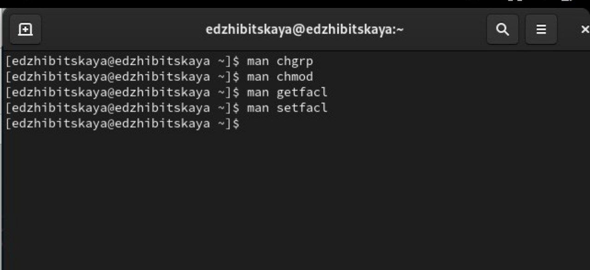
:::
::::::::::::::

## 3.3.1. Управление базовыми разрешениями

:::::::::::::: {.columns align=center}
::: {.column width="40%"}
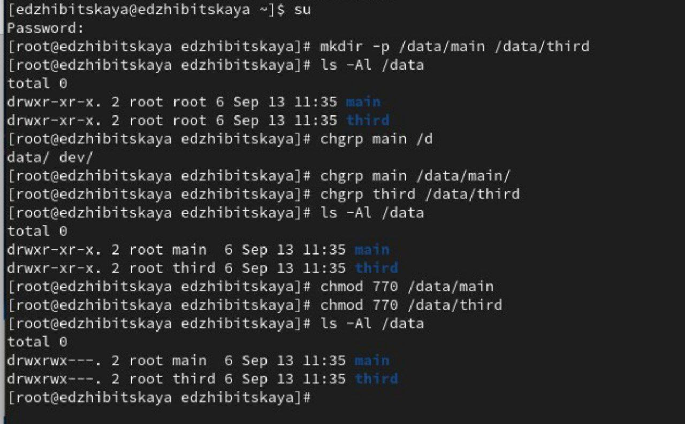
:::
::: {.column width="50%"}
Открываем терминал с root и создаем каталоги /data/main и /data/third.
Также смотрим кто является владельцем и меняем их на main и third.
установим разрешения на запись для владельцев и запрет на доступ остальным.
:::
::::::::::::::

## 3.3.1
:::::::::::::: {.columns align=center}
::: {.column width="50%"}

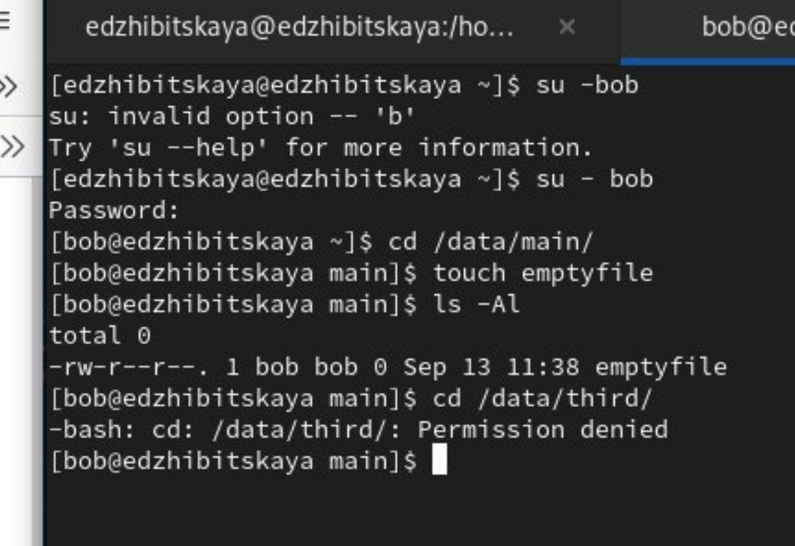
:::

::::::::::::::

## 3.3.2. Управление специальными разрешениями

:::::::::::::: {.columns align=center}
::: {.column width="50%"}

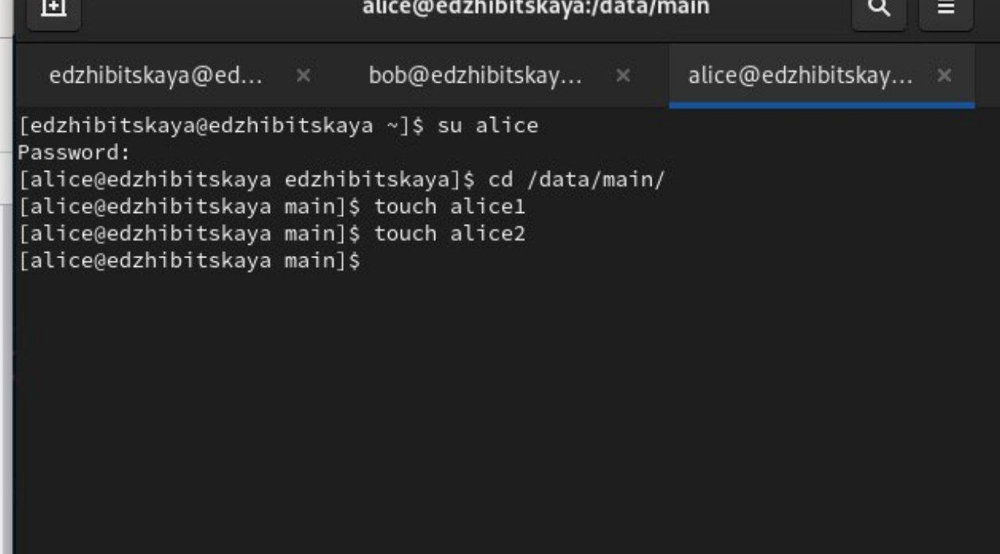
:::
::: {.column width="50%"}
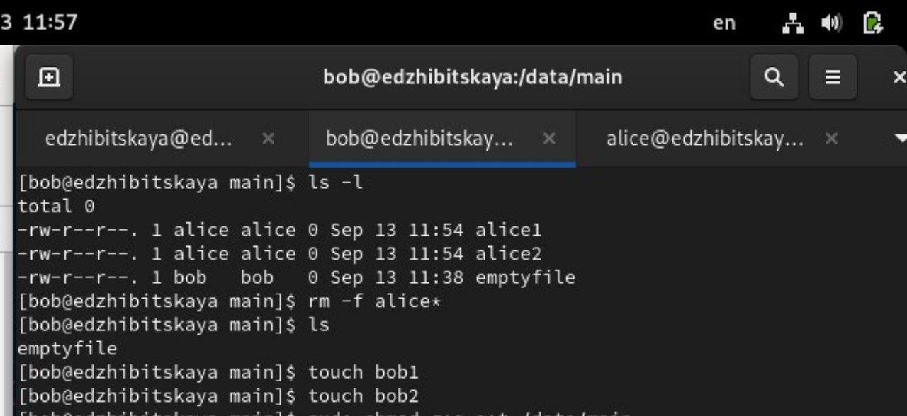
:::
::::::::::::::

## 3.3.2

:::::::::::::: {.columns align=center}
::: {.column width="50%"}
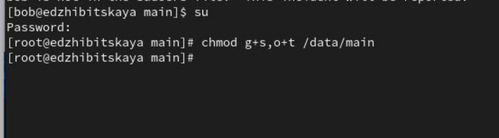
:::
::: {.column width="50%"}
Установим для каталога /data/main бит идентификатора группы, а также stiky-бит для разделяемого (общего) каталога группы.

:::
::::::::::::::

## 3.3.2

:::::::::::::: {.columns align=center}
::: {.column width="50%"}
Вернемся к Alice. Создадим еще 2 файла, посмотрим на их владельца(alice main).
Попробуем удалить файлы, принадлежащие Бобу. Это невозможно из-за подключенного sticky-бита.
:::
::: {.column width="45%"}

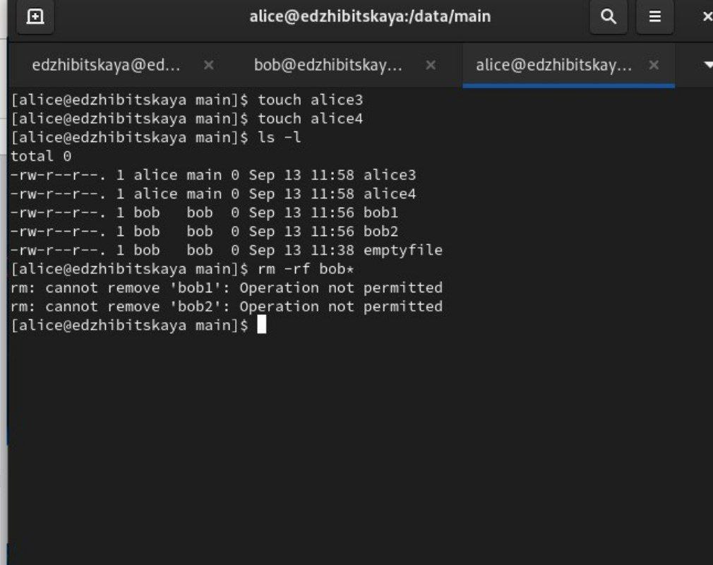
:::
::::::::::::::

## 3.3.2

:::::::::::::: {.columns align=center}
::: {.column width="40%"}
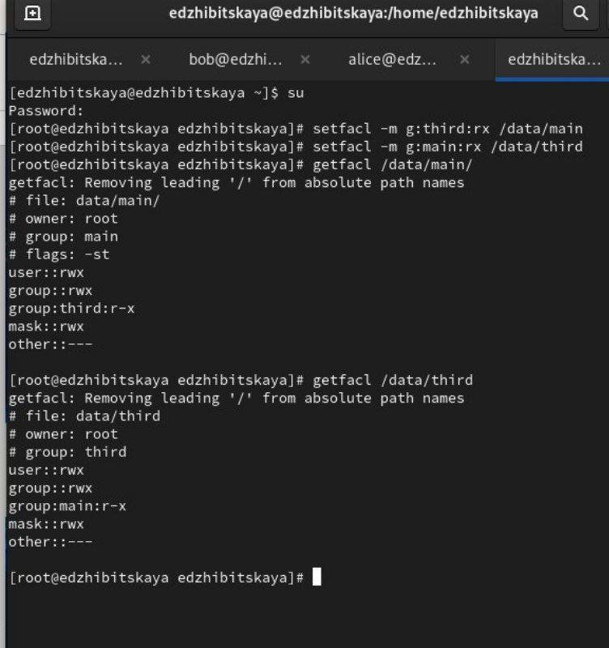
:::
::: {.column width="50%"}
Установим права на чтение и выполнение в каталоге /data/main для группы third и права на чтение и выполнение для группы main в каталоге /data/third:

:::
::::::::::::::

## 3.3.2

:::::::::::::: {.columns align=center}
::: {.column width="50%"}
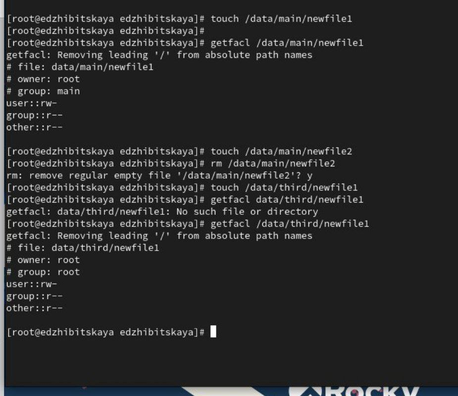
:::
::: {.column width="50%"}
Создадим новый файл newfile1 и проверим его полномочия(каталог main). Запись означает, что только владелец(root) имеет право на запись и чтение, у остальных только чтение.
Проделаем аналогичные действия для third. Там все то же самое, только группа уже root, а не main.

:::
::::::::::::::

## 3.3.3. Управление расширенными разрешениями с использованием списков ACL

:::::::::::::: {.columns align=center}
::: {.column width="40%"}
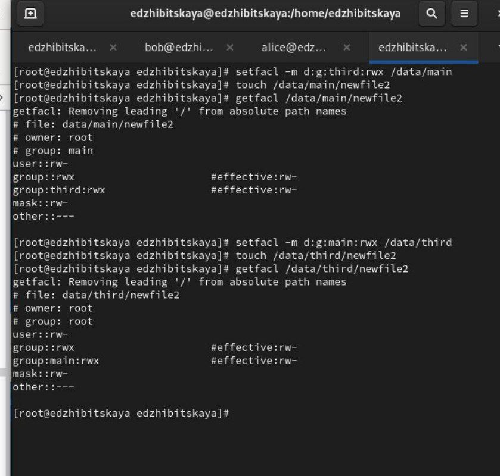
:::
::::::::::::::

## 3.3.3 
:::::::::::::: {.columns align=center}
::: {.column width="40%"}

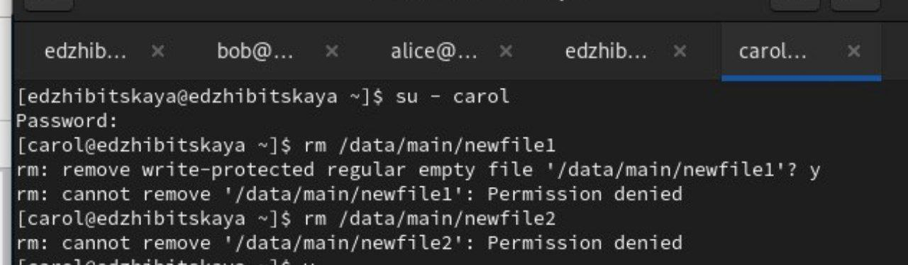
:::
::: {.column width="45%"}

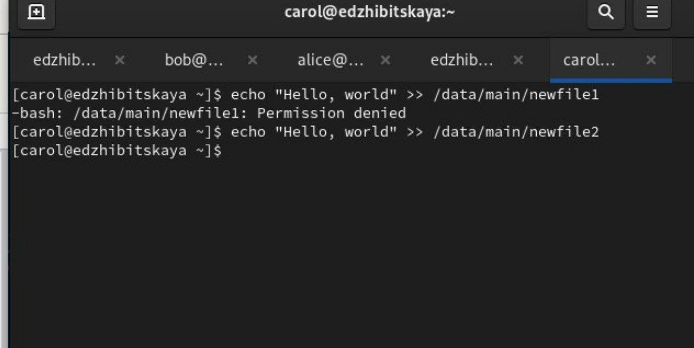
:::
::::::::::::::

# Вывод

## Вывод

- В ходе работы было произведено знакомство с правами доступа и разрешениями для групп пользователей в ОС Linux, реализовано наделение ими.

