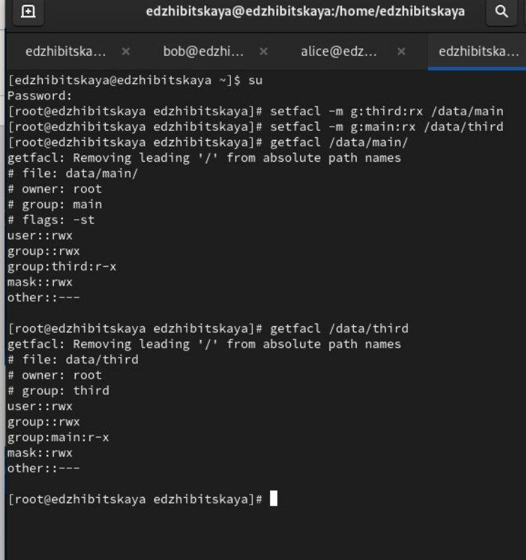

---
## Front matter
title: "Лабораторная работа №3"
subtitle: "Дисциплина: Оcновы администрирования операционных систем"
author: "Жибицкая Евгения Дмитриевна"

## Generic otions
lang: ru-RU
toc-title: "Содержание"

## Bibliography
bibliography: bib/cite.bib
csl: pandoc/csl/gost-r-7-0-5-2008-numeric.csl

## Pdf output format
toc: true # Table of contents
toc-depth: 2
lof: true # List of figures
lot: true # List of tables
fontsize: 12pt
linestretch: 1.5
papersize: a4
documentclass: scrreprt
## I18n polyglossia
polyglossia-lang:
  name: russian
  options:
	- spelling=modern
	- babelshorthands=true
polyglossia-otherlangs:
  name: english
## I18n babel
babel-lang: russian
babel-otherlangs: english
## Fonts
mainfont: PT Serif
romanfont: PT Serif
sansfont: PT Sans
monofont: PT Mono
mainfontoptions: Ligatures=TeX
romanfontoptions: Ligatures=TeX
sansfontoptions: Ligatures=TeX,Scale=MatchLowercase
monofontoptions: Scale=MatchLowercase,Scale=0.9
## Biblatex
biblatex: true
biblio-style: "gost-numeric"
biblatexoptions:
  - parentracker=true
  - backend=biber
  - hyperref=auto
  - language=auto
  - autolang=other*
  - citestyle=gost-numeric
## Pandoc-crossref LaTeX customization
figureTitle: "Рис."
tableTitle: "Таблица"
listingTitle: "Листинг"
lofTitle: "Список иллюстраций"
lotTitle: "Список таблиц"
lolTitle: "Листинги"
## Misc options
indent: true
header-includes:
  - \usepackage{indentfirst}
  - \usepackage{float} # keep figures where there are in the text
  - \floatplacement{figure}{H} # keep figures where there are in the text
---

# Цель работы

Продолжение изучения Linux. Получение навыков настройки базовых и специальных прав доступа для групп пользователей в ОС.

# Выполнение лабораторной работы

В качестве подготовки к работе и выполненения задания 1 изучим принцип работы следующих команд: chgrp, chmod, getfacl, setfacl (рис. [-@fig:001]).

{#fig:001 width=70%}

Далее перейдем к управлению базовыми разрешениями.
Открываем терминал с root и создаем каталоги /data/main и /data/third.
Также смотрим кто является владельцем и меняем их на main и third.
установим разрешения на запись для владельцев и запрет на доступ остальным(рис. [-@fig:002]).

{#fig:002 width=70%}

Откроем еще один терминал и войдем в учетную запись Bob. Перейдем в нужный каталог и попытаемся создать файл. При попытке посмотреть содержимое каталога main с новым файлом проблем не возникает, а при тех же действиях в каталоге third, пишут, что доступ запрещен, так как до этого мы сами установили такие права доступа(Bob принадлежит к группе main) (рис. [-@fig:003]).

{#fig:003 width=70%}

Откроем еще терминал под учетной записью Alice. Создадим 2 файла(рис. [-@fig:004]).

{#fig:004 width=70%}

Вернемся к Bob. Командой ls -l просмотрим содержимое и удалим все файлы принадлежащие Alice.

Убедимся, что они удалены и создадим еще два файла Bob1, Bob2 (рис. [-@fig:005]).

{#fig:005 width=70%}

В терминале с root установим для каталога /data/main бит идентификатора группы, а также stiky-бит для разделяемого (общего) каталога группы(рис. [-@fig:006]).

{#fig:006 width=70%}

Затем вернемся к Alice. Создадим еще 2 файла, посмотрим на их владельца(alice main).
Попробуем удалить файлы, принадлежащие Бобу. Это невозможно из-за подключенного sticky-бита(рис. [-@fig:007]).

{#fig:007 width=70%}

Перейдем в root. Установим права на чтение и выполнение в каталоге /data/main для группы third и права на чтение и выполнение для группы main в каталоге /data/third:

Используем команду getfacl, чтобы убедиться в правильности установки разрешений(рис. [-@fig:008]).

{#fig:008 width=70%}

Создадим новый файл newfile1 и проверим его полномочия(каталог main). Запись означает, что только владелец(root) имеет право на запись и чтение, у остальных только чтение.
Проделаем аналогичные действия для third. Там все то же самое, только группа уже root, а не main(рис. [-@fig:009]).

{#fig:009 width=70%}

Установим права на чтение и выполнение в каталоге /data/main для группы third
и права на чтение и выполнение для группы main в каталоге /data/third.
Командой getfacl, убедимся в правильности установки разрешений:
(рис. [-@fig:010]).

{#fig:010 width=70%}

Войдем в учетную запись Carol  и попробуем удалить файлы - запрет(так как нет прав администратора)(рис. [-@fig:011]).

{#fig:011 width=70%}

Наконец попробуем записать что-то в файлы. В 1 файл ничего записать не удаестся(нет права на исполнение у группы third), а во второй, благодаря ACL, это возможно(рис. [-@fig:012]).

{#fig:012 width=70%}

# Ответы на контрольные вопросы

1. Для установки владельца группы для файла с помощью команды chown нужно использовать:

      chown :группа файл
   
Пример: 
      chown bob:main /data/third/newfile1
   

2. Для поиска всех файлов, принадлежащих конкретному пользователю, можно использовать команду find. Пример:

      find /путь/к/каталогу -user имя_пользователя
   
Пример:
      find /home -user bob
   

3. Чтобы применить разрешения на чтение, запись и выполнение для всех файлов в каталоге /data для пользователей и владельцев групп, не устанавливая никаких прав для других, можно использовать команду chmod следующим образом(рис. [-@fig:013]).

{#fig:013 width=70%}

      chmod 770 /data/*
   

4. Чтобы добавить разрешение на выполнение для файла, необходимо использовать команду chmod. Пример:

      chmod +x файл
   
Пример:
      chmod +x script.sh
   

5. Команда, которая позволяет убедиться, что групповые разрешения для всех новых файлов, создаваемых в каталоге, будут присвоены владельцу группы этого каталога, называется chmod с установленным битом SGID. Пример(рис. [-@fig:014]).

     chmod g+s /путь/к/каталогу

{#fig:014 width=70%}

6. Можно использовать команду chmod. Например,  установить права доступа к каталогу, где находятся файлы, таким образом, чтобы только владелец мог удалять файлы. Это может выглядеть так:

chmod 700 /path/to/directory

7. Для добавления ACL, который предоставляет членам группы права доступа на чтение для всех существующих файлов в текущем каталоге, можно использовать команду setfacl. Например, чтобы предоставить группе "mygroup" права на чтение, используйте следующую команду(рис. [-@fig:015]).

setfacl -m g:mygroup:r /path/to/directory/*

{#fig:015 width=70%}:

8. Чтобы гарантировать, что члены группы получат разрешения на чтение для всех файлов в текущем каталоге и во всех его подкаталогах, а также для всех файлов, которые будут созданы в этом каталоге в будущем, можно использовать следующие команды:

setfacl -R -m g:mygroup:rX /path/to/directory
setfacl -R -d -m g:mygroup:rX /path/to/directory

9. Нужно установить umask на 007. 
umask 007

10. Защита файла от случайного удаления

chattr +i myfile

После этого файл не сможет быть удалён или изменён ни одним пользователем, пока атрибут не будет снят с помощью chattr -i myfile. 

# Выводы

В ходе работы было произведено знакомство с правами доступа и разрешениями для групп пользователей в ОС Linux, реализовано наделение ими.

