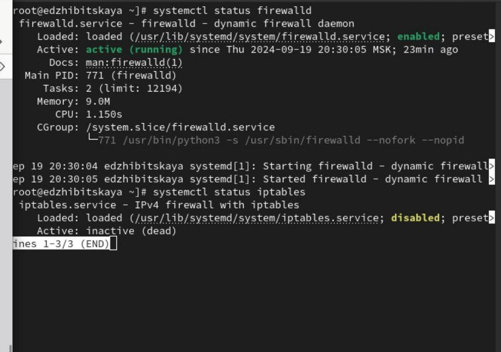

---
## Front matter
lang: ru-RU
title: Лабораторная работа №5
subtitle: Управление системными службами
author:
  - Жибицкая Е.Д.
institute:
  - Российский университет дружбы народов, Москва, Россия

## i18n babel
babel-lang: russian
babel-otherlangs: english

## Formatting pdf
toc: false
toc-title: Содержание
slide_level: 2
aspectratio: 169
section-titles: true
theme: metropolis
header-includes:
 - \metroset{progressbar=frametitle,sectionpage=progressbar,numbering=fraction}
 - '\makeatletter'
 - '\beamer@ignorenonframefalse'
 - '\makeatother'
 
## Fonts
mainfont: PT Serif
romanfont: PT Serif
sansfont: PT Sans
monofont: PT Mono
mainfontoptions: Ligatures=TeX
romanfontoptions: Ligatures=TeX
sansfontoptions: Ligatures=TeX,Scale=MatchLowercase
monofontoptions: Scale=MatchLowercase,Scale=0.9
---

# Цель работы

## Цель работы

- Продолжение изучения ОС Linux. Знакомство и получение навыков управления системными службами операционной системы посредством systemd.

# Выполнение работы

## 5.4.1. Управление сервисами

:::::::::::::: {.columns align=center}
::: {.column width="35%"}

:::
::: {.column width="50%"}

:::
::::::::::::::

## 5.4.1
:::::::::::::: {.columns align=center}
::: {.column width="45%"}

:::
::: {.column width="50%"}

{#fig:004 width=70%}
:::

::::::::::::::

## 5.4.1
:::::::::::::: {.columns align=center}
::: {.column width="40%"}

Выведем на экран символические ссылки, ответственные за запуск различных сервисов. Снова добавим автозапуск и повторим вывод ссылок.
:::
::: {.column width="40%"}

:::
::::::::::::::

## 5.4.1
:::::::::::::: {.columns align=center}
::: {.column width="40%"}

:::
::: {.column width="40%"}

Опять проверим статус. Увидим, что для файла юнита состояние изменено.
:::
::::::::::::::

## 5.4.1
:::::::::::::: {.columns align=center}
::: {.column width="40%"}

:::
::: {.column width="50%"}

:::
::::::::::::::

## 5.4.2. Конфликты юнитов
:::::::::::::: {.columns align=center}
::: {.column width="45%"}

:::
::: {.column width="50%"}

:::
::::::::::::::

## 5.4.2

:::::::::::::: {.columns align=center}
::: {.column width="50%"}
Попробуем запустить их. Увидим, что сделать одновременно это невозможно - одна из служб дезактивируется при запуске второй.
:::
::: {.column width="40%"}

:::
::::::::::::::

## 5.4.2

:::::::::::::: {.columns align=center}
::: {.column width="40%"}

:::
::: {.column width="50%"}

:::
::::::::::::::

## 5.4.2

:::::::::::::: {.columns align=center}
::: {.column width="40%"}

:::
::: {.column width="60%"}
Выгрузим службу iptables, запустим firewalld, заблокируем запуск iptables (создана символическая ссылка на /dev/null для /etc/systemd/system/iptables.service) и попробуем запустить. Также попробуем добавить службу в автозапуск
:::
::::::::::::::

## 5.4.3. Изолируемые цели

:::::::::::::: {.columns align=center}
::: {.column width="45%"}

:::

::::::::::::::

## 5.4.3
:::::::::::::: {.columns align=center}
::: {.column width="40%"}

:::
::: {.column width="50%"}

:::
::::::::::::::

## 5.4.4. Цель по умолчанию
:::::::::::::: {.columns align=center}
::: {.column width="40%"}
Выведем установленную по умолчанию цель - systemctl get-default. Далее, для запуска по умолчанию текстового режима введем systemctl set-default multi-user.target
:::
::: {.column width="50%"}

:::
::::::::::::::

## 5.4.4
:::::::::::::: {.columns align=center}
::: {.column width="40%"}

:::
::: {.column width="35%"}

:::
::::::::::::::

# Вывод

## Вывод

- В ходе работы было произведено знакомство с системными службами операционной системы. Были получены навыки управления системными службами посредством systemd.

