---
## Front matter
title: "Лабораторная работа №5"
subtitle: "Дисциплина: Оcновы администрирования операционных систем"
author: "Жибицкая Евгения Дмитриевна"

## Generic otions
lang: ru-RU
toc-title: "Содержание"

## Bibliography
bibliography: bib/cite.bib
csl: pandoc/csl/gost-r-7-0-5-2008-numeric.csl

## Pdf output format
toc: true # Table of contents
toc-depth: 2
lof: true # List of figures
lot: true # List of tables
fontsize: 12pt
linestretch: 1.5
papersize: a4
documentclass: scrreprt
## I18n polyglossia
polyglossia-lang:
  name: russian
  options:
	- spelling=modern
	- babelshorthands=true
polyglossia-otherlangs:
  name: english
## I18n babel
babel-lang: russian
babel-otherlangs: english
## Fonts
mainfont: PT Serif
romanfont: PT Serif
sansfont: PT Sans
monofont: PT Mono
mainfontoptions: Ligatures=TeX
romanfontoptions: Ligatures=TeX
sansfontoptions: Ligatures=TeX,Scale=MatchLowercase
monofontoptions: Scale=MatchLowercase,Scale=0.9
## Biblatex
biblatex: true
biblio-style: "gost-numeric"
biblatexoptions:
  - parentracker=true
  - backend=biber
  - hyperref=auto
  - language=auto
  - autolang=other*
  - citestyle=gost-numeric
## Pandoc-crossref LaTeX customization
figureTitle: "Рис."
tableTitle: "Таблица"
listingTitle: "Листинг"
lofTitle: "Список иллюстраций"
lotTitle: "Список таблиц"
lolTitle: "Листинги"
## Misc options
indent: true
header-includes:
  - \usepackage{indentfirst}
  - \usepackage{float} # keep figures where there are in the text
  - \floatplacement{figure}{H} # keep figures where there are in the text
---

# Цель работы

Продолжение изучения ОС Linux. Знакомство и получение навыков управления системными службами операционной системы посредством systemd.

# Выполнение лабораторной работы

Ознакомимся с различной информацией по теме, затем перейдем в режим суперпользователя, командой systemctl status vsftpd проверим статус службы Very Secure FTP. Установим ее(рис. [-@fig:001]).

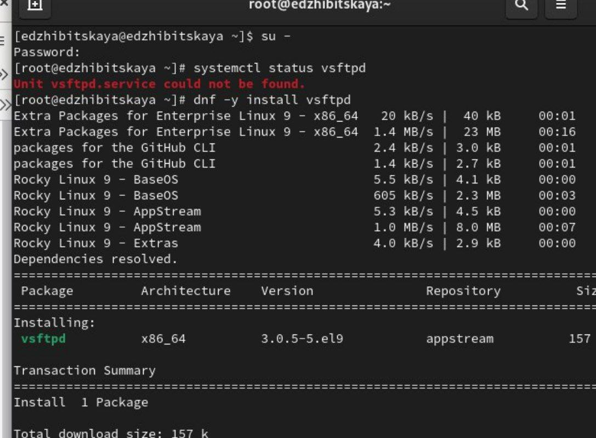{#fig:001 width=70%}

Запустим службу и также проверим ее статус(рис. [-@fig:002]).

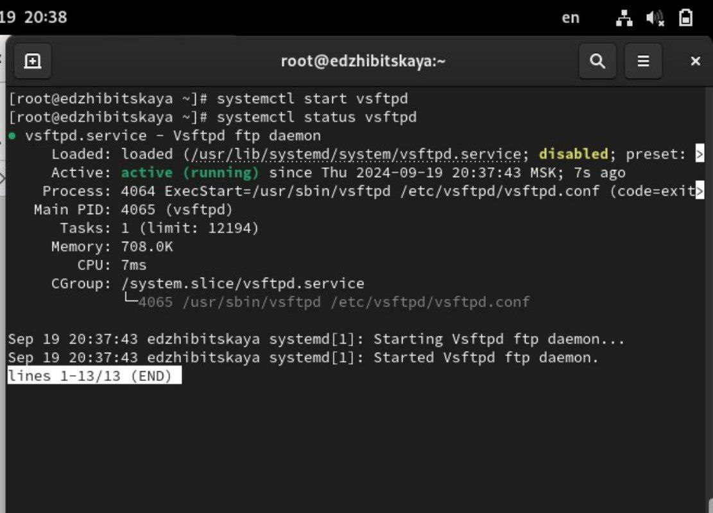{#fig:002 width=70%}

Командой enable добавим службу Very Secure FTP в автозапуск при загрузке ОС, проверим статус(рис. [-@fig:003]).

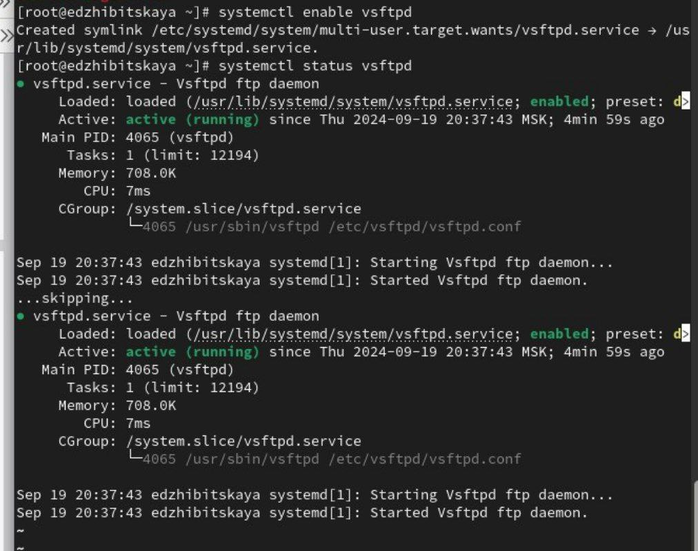{#fig:003 width=70%}

Удалим автозапуск при загрузке системы, также проверим статус(рис. [-@fig:004]).

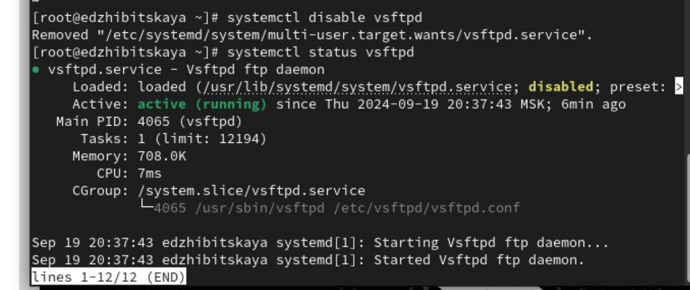{#fig:004 width=70%}

Выведем на экран символические ссылки, ответственные за запуск различных сервисов - увидим, что ссылка на vsftpd.service не существует.
Снова добавим службу Very Secure FTP в автозапуск:
systemctl enable vsftpd
и выведим на экран символические ссылки, ответственные за запуск различных сервисов. Увидим, что создана символическая ссылка для
файла /usr/lib/systemd/system/vsftpd.service в каталоге
/etc/systemd/system/multi-user.target.wants.(рис. [-@fig:005]).

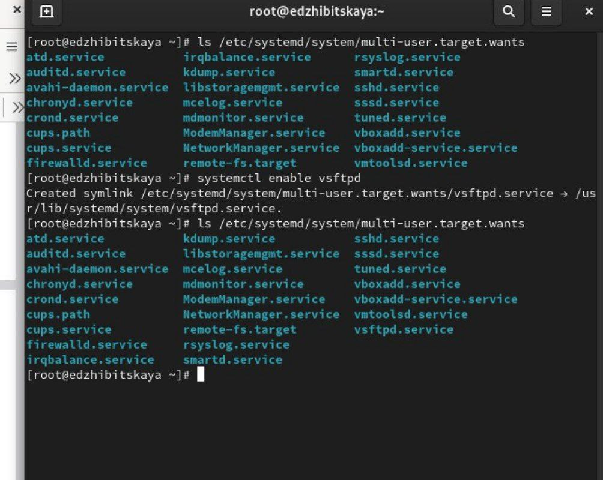{#fig:005 width=70%}

Опять проверим статус. Увидим, что для файла юнита состояние изменено (рис. [-@fig:006]).

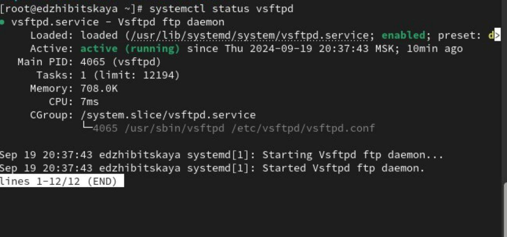{#fig:006 width=70%}

Также, выведем список зависимостей юнита - systemctl list-dependencies vsftpd и список юнитов, которые зависят от данного юнита - systemctl list-dependencies vsftpd --reverse(рис. [-@fig:007]) и (рис. [-@fig:008]).

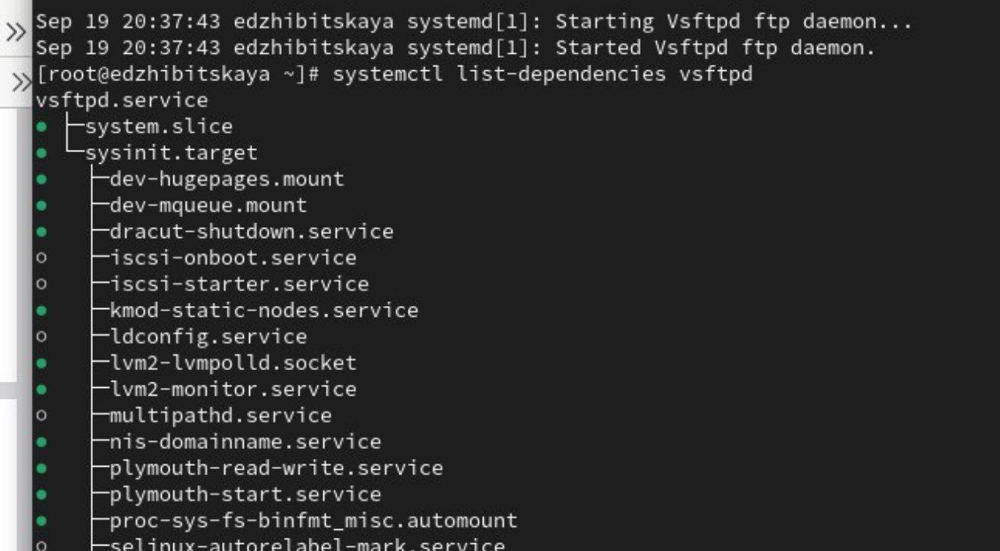{#fig:007 width=70%}

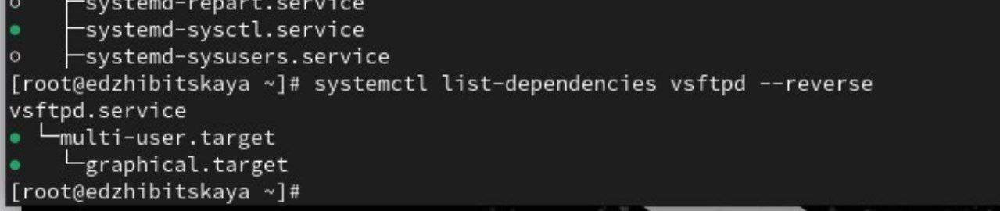{#fig:008 width=70%}

Перейдем к изучению конфликтов юнитов.
Получим необходимые полномочия и установим iptables(рис. [-@fig:009]).

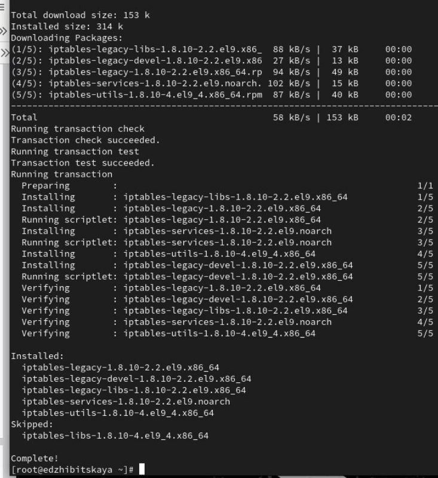{#fig:009 width=70%}

После скачивания, проверим статусы firewalld и iptables(рис. [-@fig:010]).

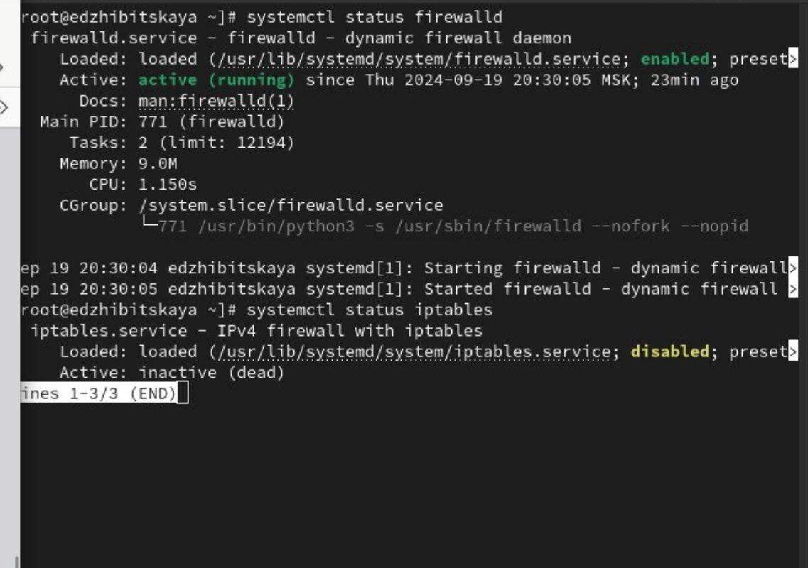{#fig:010 width=70%}

Попробуем запустить их. Увидим, что сделать одновременно это невозможно - одна из служб дезактивируется при запуске второй(рис. [-@fig:011]).

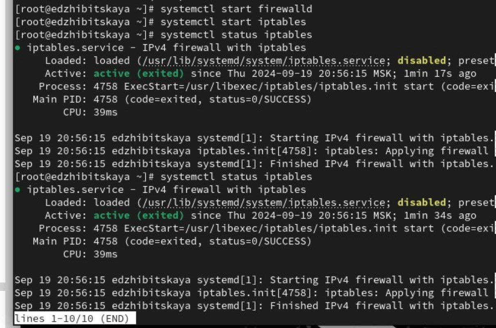{#fig:011 width=70%}

Используем команды cat /usr/lib/systemd/system/firewalld.service и cat /usr/lib/systemd/system/iptables.service. При выводе результата видим, что iptables является конфликтом для firewalld(рис. [-@fig:012]) и (рис. [-@fig:013]).

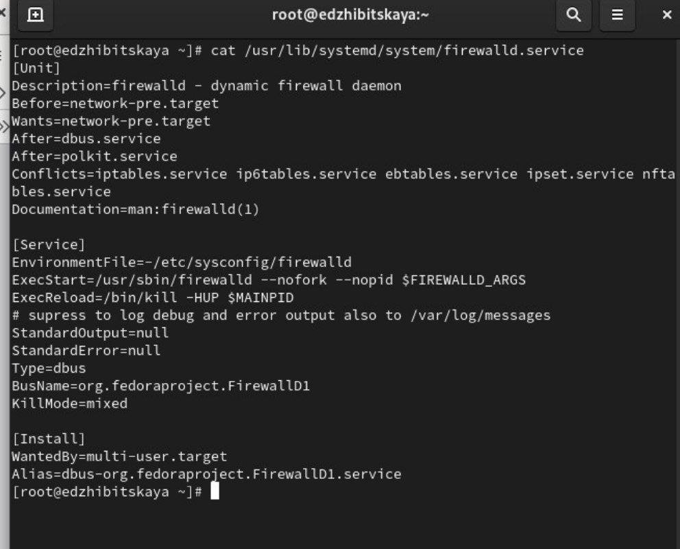{#fig:012 width=70%}

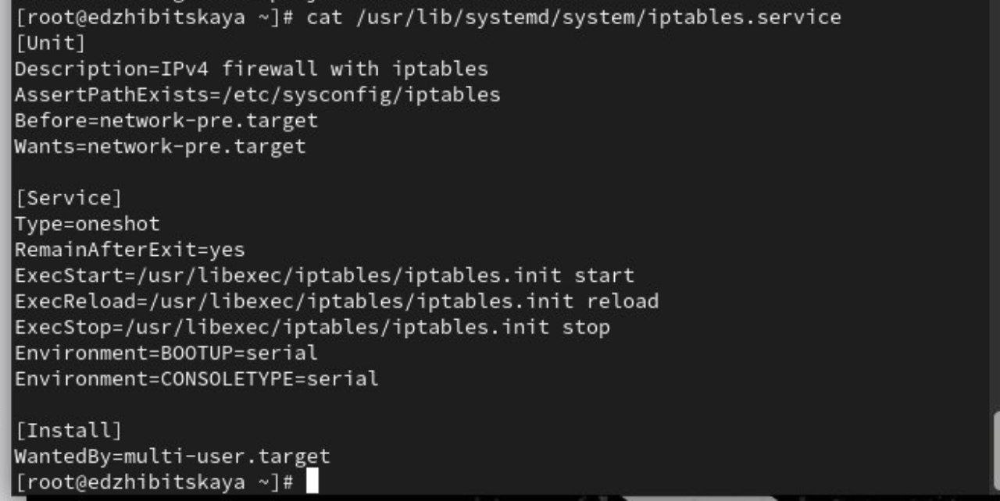{#fig:013 width=70%}

Выгрузим службу iptables, запустим firewalld, заблокируем запуск iptables (создана символическая ссылка на /dev/null для /etc/systemd/system/iptables.service) и попробуем запустить. Также попробуем добавить службу в автозапуск(рис. [-@fig:014]).

{#fig:014 width=70%}

Изучим изолируемые цели.
Получим список всех активных целей и просто всех целей(рис. [-@fig:015]).

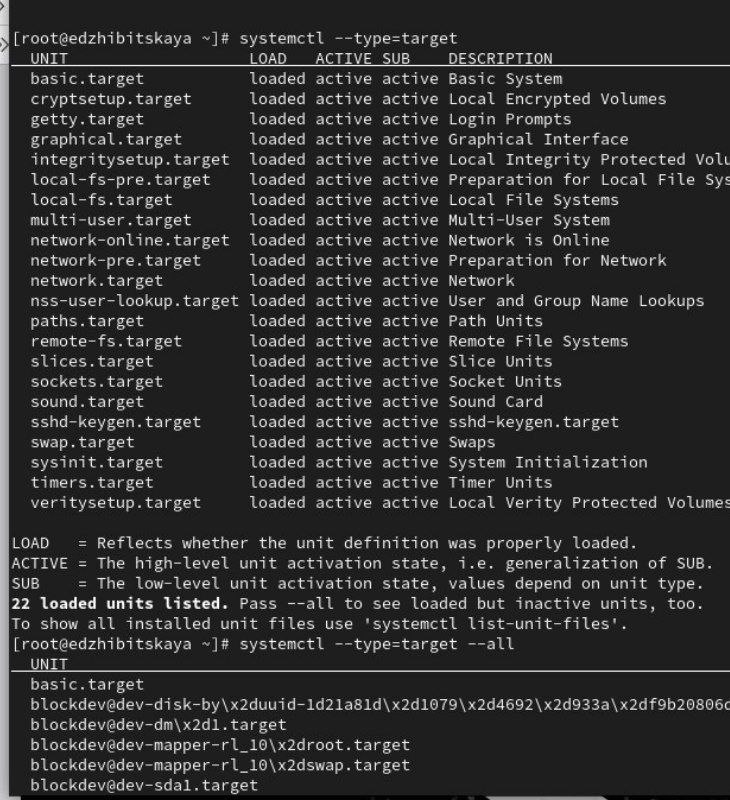{#fig:015 width=70%}

Далее получим список всех целей, которые можно изолировать, используем команды cd /usr/lib/systemd/system
grep Isolate *.target(рис. [-@fig:016]).

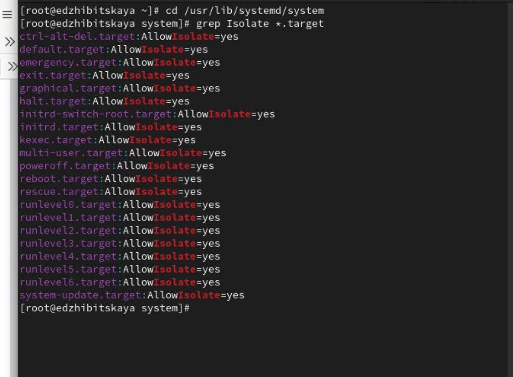{#fig:016 width=70%}

Переключимся в режим восстановления - systemctl isolate rescue.target и перезапустим систему(рис. [-@fig:017]).

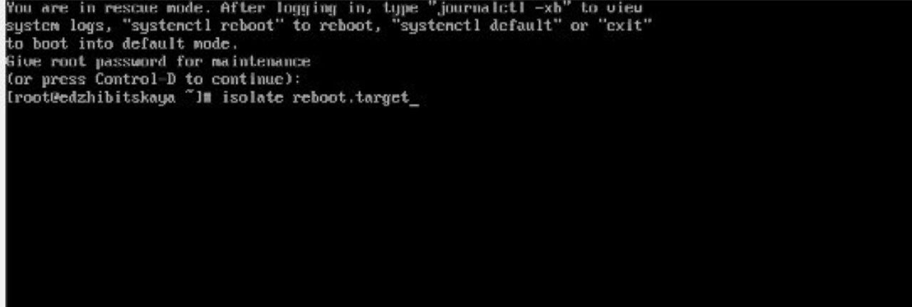{#fig:017 width=70%}

Изучим цели по умолчанию.
Выведем установленную по умолчанию цель - systemctl get-default. Далее, для запуска по умолчанию текстового режима введем systemctl set-default multi-user.target(рис. [-@fig:018]).

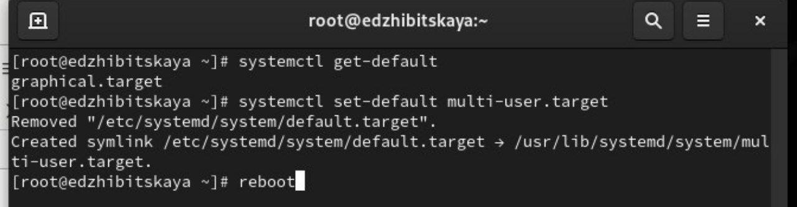{#fig:018 width=70%}

Перезапустим систему. Получив полномочия, командой systemctl set-default graphical.target вернем графический режим(рис. [-@fig:019]).

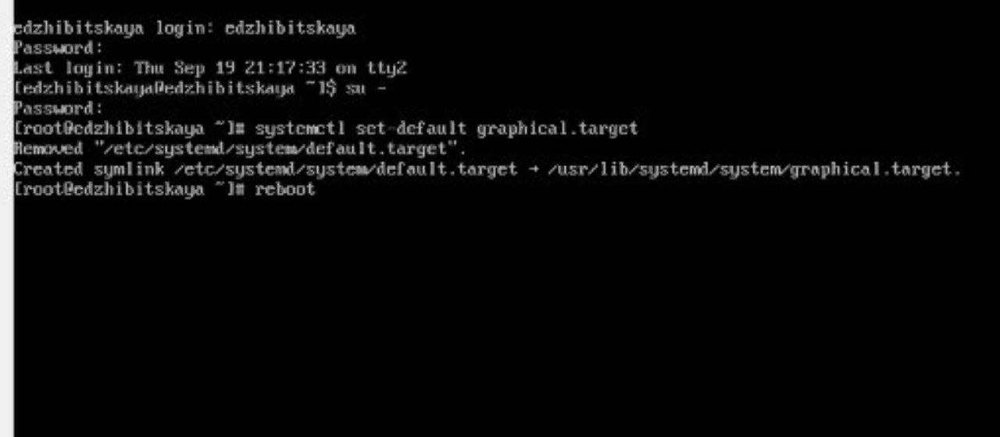{#fig:019 width=70%}

Перезапустим систему и убедимся, что по умолчанию открывается яграфический режим(рис. [-@fig:020]).

{#fig:020 width=70%}

# Ответы на контрольные вопросы

1. Что такое юнит (unit)? Приведите примеры.
   Юнит systemd — это основной объект управления, используемый для описания различных ресурсов и служб в системе. Каждый юнит имеет определенный тип и может управлять различными компонентами. Примеры юнитов:
   - service: управляет службами (например, httpd.service).
   - socket: используется для управления сокетами, на которые могут подписываться службы (например, http.socket).
   - target: группа юнитов, которые могут быть запущены вместе (например, multi-user.target).
   - timer: запускает юниты по расписанию (например, apt-daily.timer).

2. Какая команда позволяет вам убедиться, что цель больше не входит в список автоматического запуска при загрузке системы?
      systemctl disable <target_name>(рис. [-@fig:021]).

{#fig:021 width=70%}
   
Для проверки статуса можно использовать:
      systemctl is-enabled <target_name>
   

3. Какую команду вы должны использовать для отображения всех сервисных юнитов, которые в настоящее время загружены?
   Для отображения всех загруженных сервисных юнитов используйте команду:
      systemctl list-units --type=service
   

4. Как создать потребность (wants) в сервисе?
   Чтобы создать зависимость типа wants для юнита, необходимо отредактировать конфигурацию юнита (обычно это файл .wants в каталоге, например, /etc/systemd/system/<target>.wants/). В этом каталоге необходимо создать символическую ссылку на нужный юнит:
      ln -s /etc/systemd/system/<service>.service /etc/systemd/system/<target>.wants/
   

5. Как переключить текущее состояние на цель восстановления (rescue target)?
   Для переключения на цель восстановления используйте команду:
      systemctl isolate rescue.target(рис. [-@fig:022]).

{#fig:022 width=70%}
   

6. Поясните причину получения сообщения о том, что цель не может быть изолирована.
   Сообщение о том, что цель не может быть изолирована, может появиться, если в системе есть активные юниты, которые мешают изоляции. 

7. Вы хотите отключить службу systemd, но, прежде чем сделать это, вы хотите узнать, какие другие юниты зависят от этой службы. Какую команду вы бы использовали?
   Для того чтобы узнать, какие юниты зависят от определенной службы, используем команду:
      systemctl list-dependencies <service_name>(рис. [-@fig:023]).

{#fig:023 width=70%}

# Выводы

В ходе работы было произведено знакомство с системными службами операционной системы. Были получены навыки управления системными службами посредством systemd.

# Список литературы{.unnumbered}

[ТУИС](https://esystem.rudn.ru/pluginfile.php/2400698/mod_resource/content/4/006-service.pdf)
