---
## Front matter
lang: ru-RU
title: Лабораторная работа №6
subtitle: Управление процессами
author:
  - Жибицкая Е.Д.
institute:
  - Российский университет дружбы народов, Москва, Россия

## i18n babel
babel-lang: russian
babel-otherlangs: english

## Formatting pdf
toc: false
toc-title: Содержание
slide_level: 2
aspectratio: 169
section-titles: true
theme: metropolis
header-includes:
 - \metroset{progressbar=frametitle,sectionpage=progressbar,numbering=fraction}
 - '\makeatletter'
 - '\beamer@ignorenonframefalse'
 - '\makeatother'
 
## Fonts
mainfont: PT Serif
romanfont: PT Serif
sansfont: PT Sans
monofont: PT Mono
mainfontoptions: Ligatures=TeX
romanfontoptions: Ligatures=TeX
sansfontoptions: Ligatures=TeX,Scale=MatchLowercase
monofontoptions: Scale=MatchLowercase,Scale=0.9
---

# Цель работы

## Цель работы

 - Продолжение изучения ОС Linux. Изучение и получение навыков по управлению процессами ОС.
 
# Выполнение работы

## 6.4.1. Управление заданиями

:::::::::::::: {.columns align=center}
::: {.column width="35%"}
Получим полномочия администратора и введем команды 

Последняя команда была запущена не в фоновом режиме, поэтому для выхода понадобится сочетание клавиш ctr Z
:::
::: {.column width="50%"}

:::
::::::::::::::

## 6.4.1
:::::::::::::: {.columns align=center}
::: {.column width="40%"}
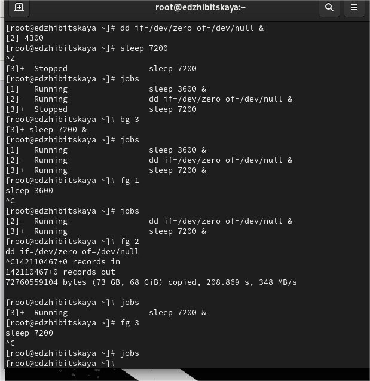
:::
::: {.column width="50%"}

Командой jobs посмотрим на состояние заданий.
Затем, используя bg 3, продолжим выполнение 3 задания. Переместим командой fg 1 задание 1 на передний план, отменим его и проверим с помощью jobs. Выполним аналогичные действия для заданий 2 и 3
:::

::::::::::::::

## 6.4.1
:::::::::::::: {.columns align=center}
::: {.column width="40%"}

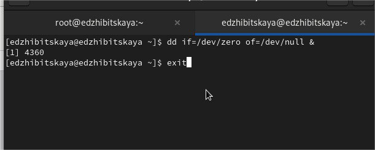
:::
::: {.column width="40%"}

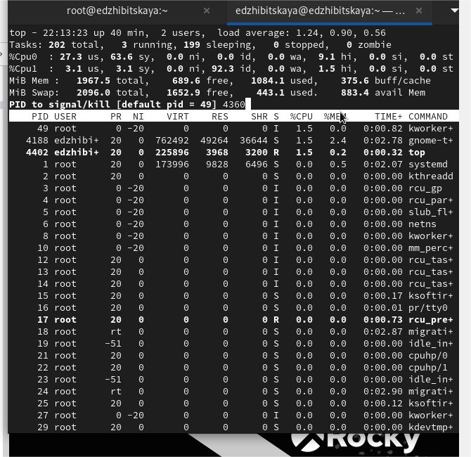
:::
::::::::::::::

## 6.4.2. Управление процессами
:::::::::::::: {.columns align=center}
::: {.column width="40%"}
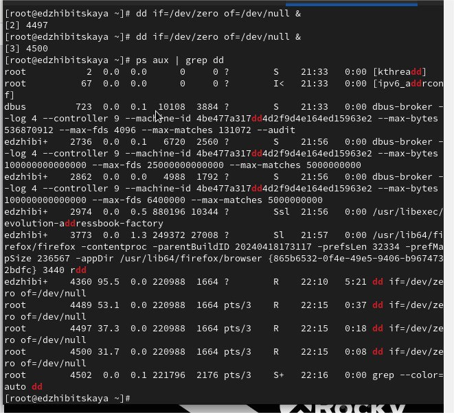

:::

::::::::::::::

## 6.4.2
:::::::::::::: {.columns align=center}
::: {.column width="40%"}

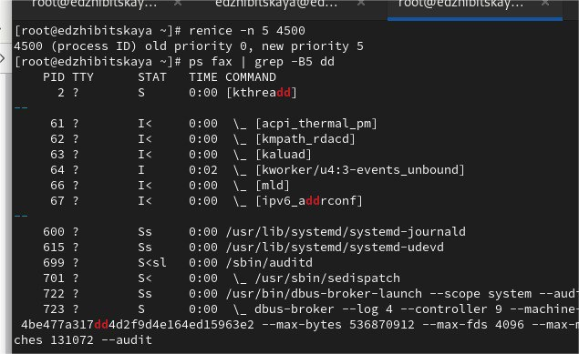
:::
::: {.column width="45%"}
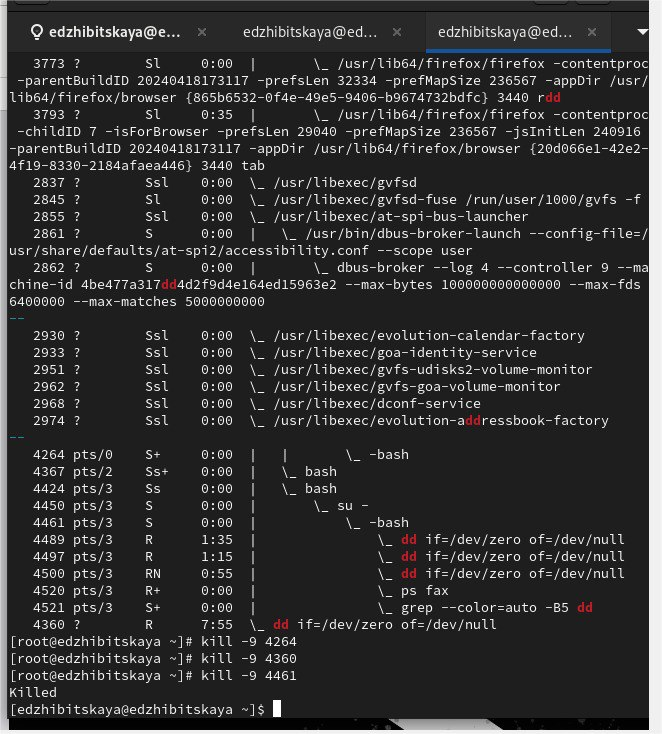
:::
::::::::::::::

## Самостоятельная работа. Задание 1
:::::::::::::: {.columns align=center}
::: {.column width="45%"}
Запустим команду dd if=/dev/zero of=/dev/null в фоновом режиме трижды. Командой renice изменим приоритет процесса сначала на 5, затем  на 15. Завершим все процессы командой killall dd.
:::
::: {.column width="45%"}
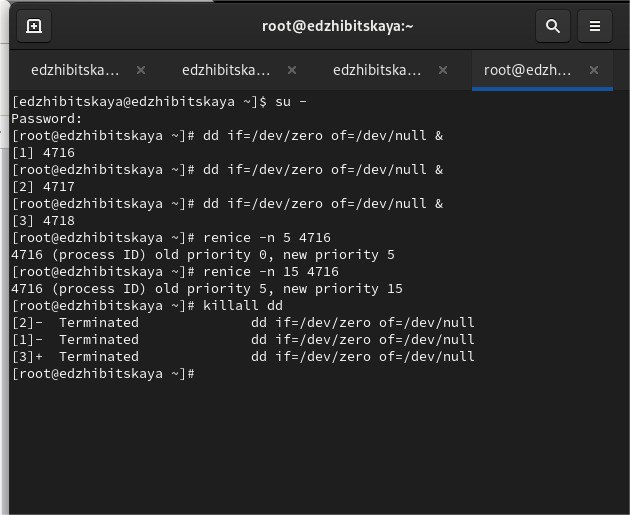
:::
::::::::::::::

## Самостоятельная работа. Задание 2

:::::::::::::: {.columns align=center}
::: {.column width="45%"}
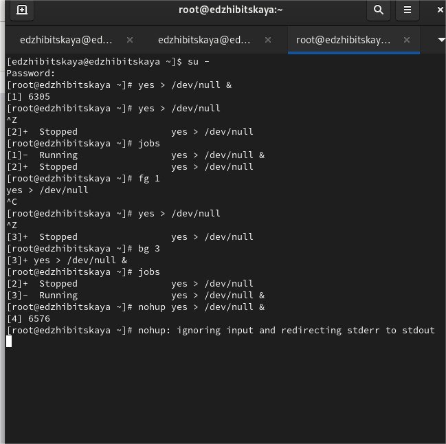
:::
::: {.column width="40%"}

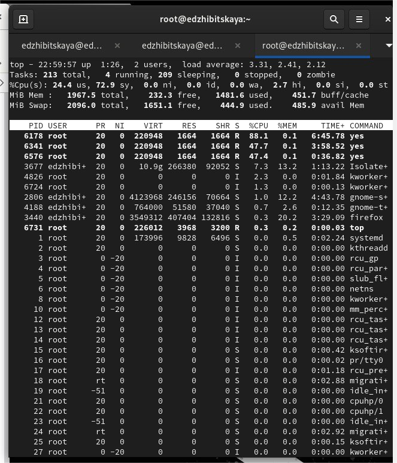
:::
::::::::::::::

## Самостоятельная работа. Задание 2
:::::::::::::: {.columns align=center}
::: {.column width="40%"}
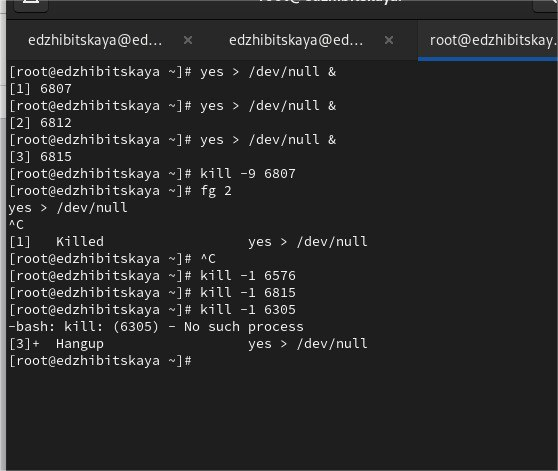
:::
::: {.column width="50%"}
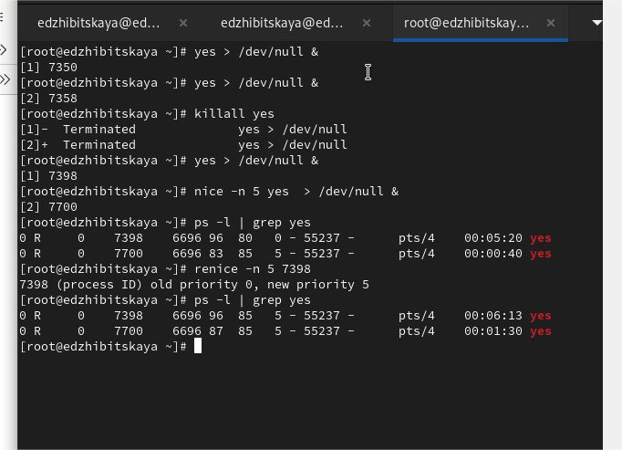
:::
::::::::::::::

# Вывод

## Вывод

- В ходе работы было произведено знакомство с принципами управления процессами, получены навыки и проделаны различные действия по запуску и остановке процессов, заданий.

