---
## Front matter
title: "Лабораторная работа №6"
subtitle: "Дисциплина: Оcновы администрирования операционных систем"
author: "Жибицкая Евгения Дмитриевна"

## Generic otions
lang: ru-RU
toc-title: "Содержание"

## Bibliography
bibliography: bib/cite.bib
csl: pandoc/csl/gost-r-7-0-5-2008-numeric.csl

## Pdf output format
toc: true # Table of contents
toc-depth: 2
lof: true # List of figures
lot: true # List of tables
fontsize: 12pt
linestretch: 1.5
papersize: a4
documentclass: scrreprt
## I18n polyglossia
polyglossia-lang:
  name: russian
  options:
	- spelling=modern
	- babelshorthands=true
polyglossia-otherlangs:
  name: english
## I18n babel
babel-lang: russian
babel-otherlangs: english
## Fonts
mainfont: PT Serif
romanfont: PT Serif
sansfont: PT Sans
monofont: PT Mono
mainfontoptions: Ligatures=TeX
romanfontoptions: Ligatures=TeX
sansfontoptions: Ligatures=TeX,Scale=MatchLowercase
monofontoptions: Scale=MatchLowercase,Scale=0.9
## Biblatex
biblatex: true
biblio-style: "gost-numeric"
biblatexoptions:
  - parentracker=true
  - backend=biber
  - hyperref=auto
  - language=auto
  - autolang=other*
  - citestyle=gost-numeric
## Pandoc-crossref LaTeX customization
figureTitle: "Рис."
tableTitle: "Таблица"
listingTitle: "Листинг"
lofTitle: "Список иллюстраций"
lotTitle: "Список таблиц"
lolTitle: "Листинги"
## Misc options
indent: true
header-includes:
  - \usepackage{indentfirst}
  - \usepackage{float} # keep figures where there are in the text
  - \floatplacement{figure}{H} # keep figures where there are in the text
---

# Цель работы

Продолжение изучения ОС Linux. Изучение и получение навыков по управлению процессами ОС.

# Выполнение лабораторной работы

Ознакомимся с теоретической частью и перейдем к управлению заданиями. Получим полномочия администратора и введем команды 
sleep 3600 &

dd if=/dev/zero of=/dev/null &

sleep 7200 
Последняя команда была запущена не в фоновом режиме, поэтому для выхода понадобится сочетание клавиш ctr Z(рис. [-@fig:001]).

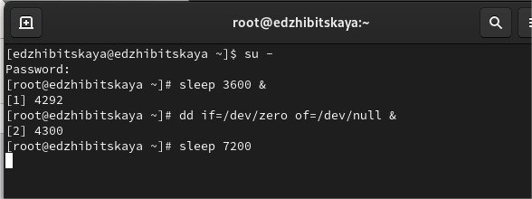{#fig:001 width=70%}

Командой jobs посмотрим на состояние заданий.
Затем, используя bg 3, продолжим выполнение 3 задания. Переместим командой fg 1 задание 1 на передний план, отменим его и проверим с помощью jobs. Выполним аналогичные действия для заданий 2 и 3(рис. [-@fig:002]).

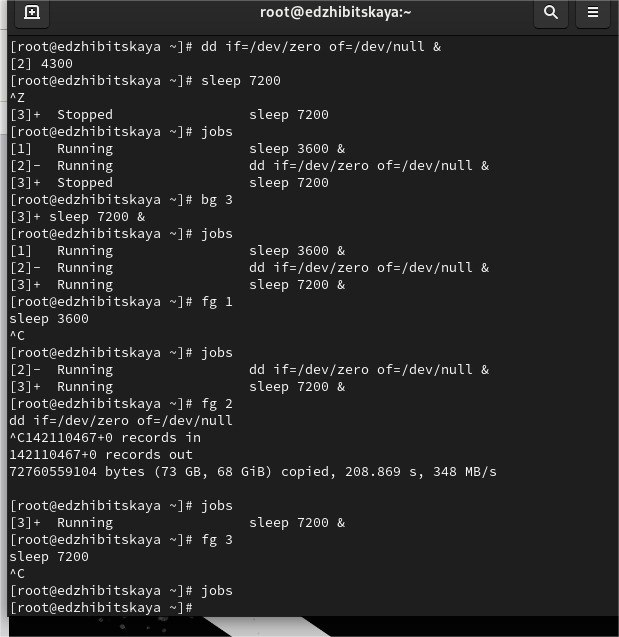{#fig:002 width=70%}

Под учетной записью пользователя введем команду dd if=/dev/zero of=/dev/null &, а затем выйдем и закроем терминал(рис. [-@fig:003]).

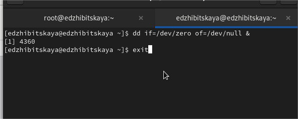{#fig:003 width=70%}

Использовав команду top, увидим, что задание все равно запущено. Введем k и его номер, тем самым прекратив выполнение (рис. [-@fig:004]).

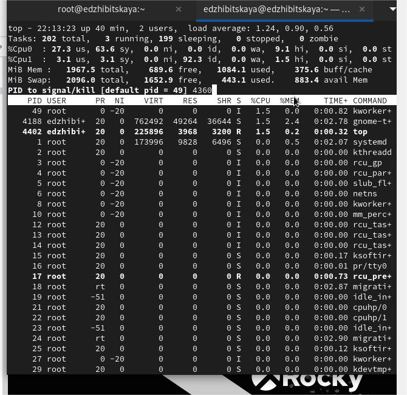{#fig:004 width=70%}

Перейдем к управлению процессами. 
Трижды введем команду dd if=/dev/zero of=/dev/null &. После найдем ксе строки, содержащие dd - ps aux | grep dd(рис. [-@fig:005]).

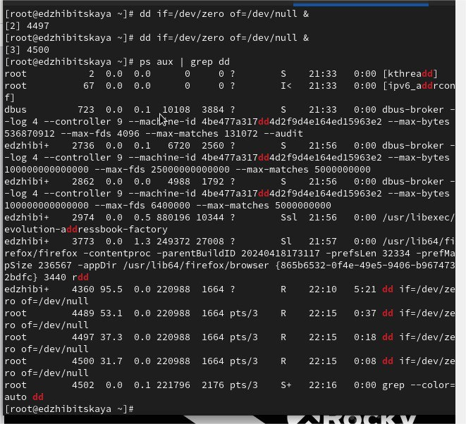{#fig:005 width=70%}

Изменим приоритет одного из процессов на 5, затем введем команду, показывающую иерархию отношений между процессами(также параметр -B5 показывает соответствующие запросу строки, включая пять строк до
этого) - ps fax | grep -B5 dd (рис. [-@fig:006]).

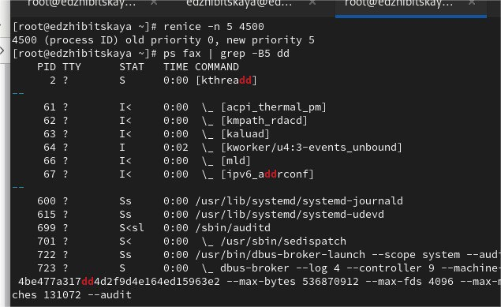{#fig:006 width=70%}

Найдем номер корневой оболочки и остановим все запущенные процессы(рис. [-@fig:007]).

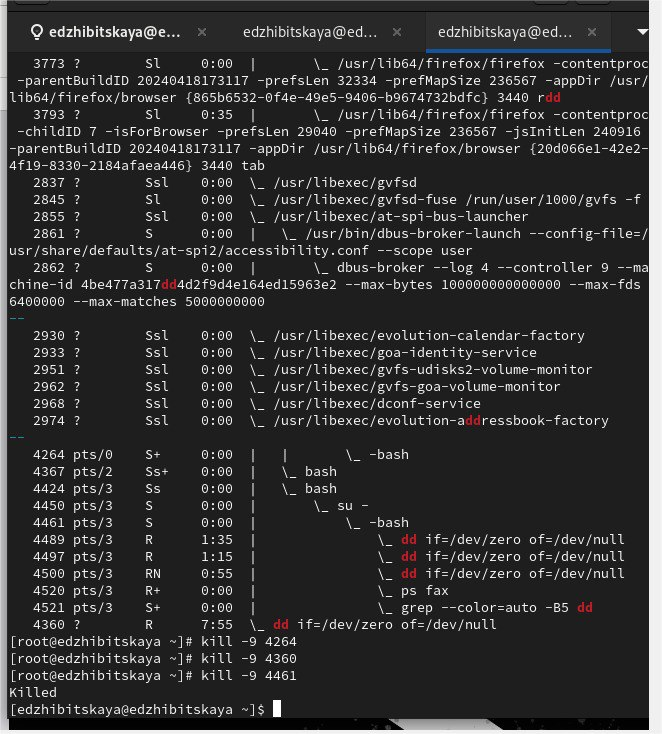{#fig:007 width=70%}

Приступим к выполнению самостоятельной работы.
Выполним задание 1.
Для этого запустим команду dd if=/dev/zero of=/dev/null в фоновом режиме трижды. Командой renice изменим приоритет процесса сначала на 5, затем  на 15. Завершим все процессы командой killall dd(рис. [-@fig:008]).

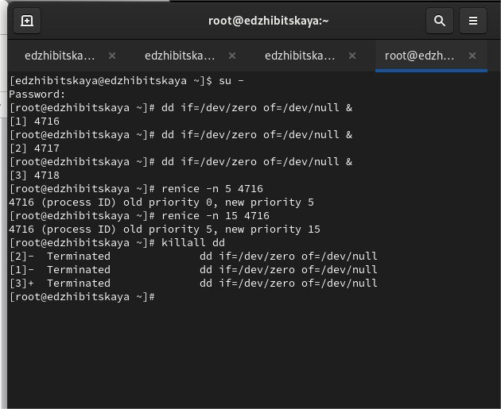{#fig:008 width=70%}

Выполним задание 2.
Запустим программу yes в фоновом режиме с подавлением потока вывода, а также на переднем плане с подавлением потока вывода(отличие в &). 
Приостановим их выполнение.
Командой jobs проверим состояние.
Переведем процесс, который  выполняется в фоновом режиме, на передний
план(fg 1) и остановим его.
Переведем еще один процесс в фоновый режим( bg 3), проверим состояние процессов
Далее запустим процесс в фоновом режиме таким образом, чтобы он продолжил свою
работу даже после отключения от терминала(с помощью nohup)(рис. [-@fig:009]).
Закроем  окно и заново запустим консоль. Убедимся, что процесс продолжил свою работу.
Получим информацию о запущенных в операционной системе процессах с помощью утилиты top(рис. [-@fig:010]).

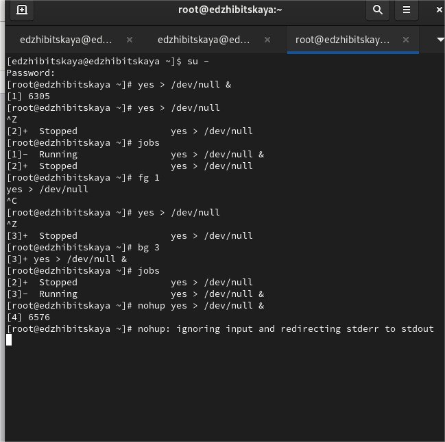{#fig:009 width=70%}

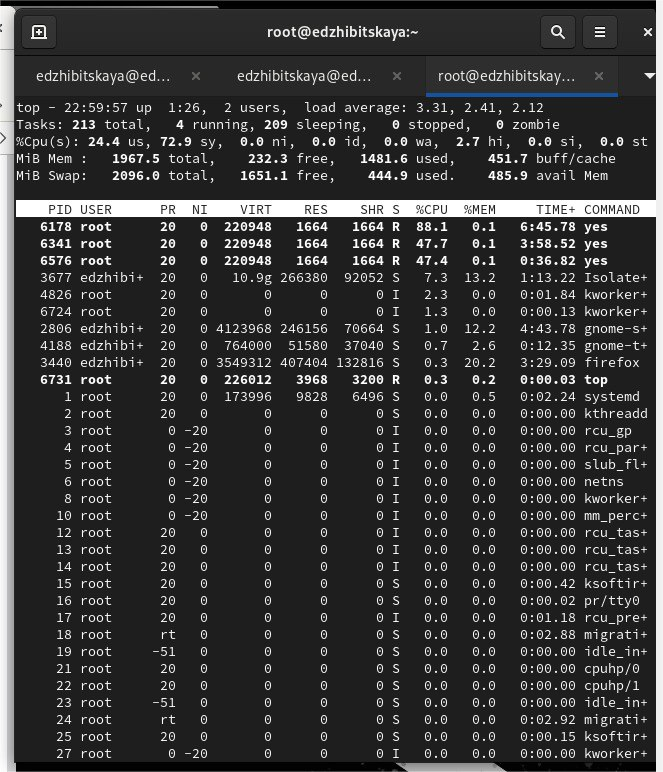{#fig:010 width=70%}

Запустим еще 3 программы в фоновом режиме с подавлением потока вывода. Завершим первый процесс командой kill -9(используя PID), а второй - используя его идентификатор. Попробуем также  послать сигнал 1 (SIGHUP) процессу, запущенному с помощью nohup,
и оставшемуся процессу.(рис. [-@fig:011]).

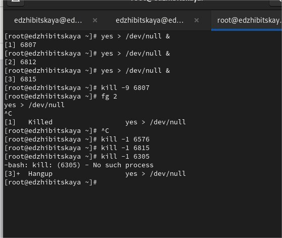{#fig:011 width=70%}

Запустим 2 аналогичные программы. Командой killall завершим их работу одновременно.
Создадим еще 1 программу, затем командой nice запусти программу yes с приоритетом большим на 5. 
Сравним приоритеты(воспользовавшись фильтром), затем утилитой renice сравняем их значения и завершим нашу работу(рис. [-@fig:012]).

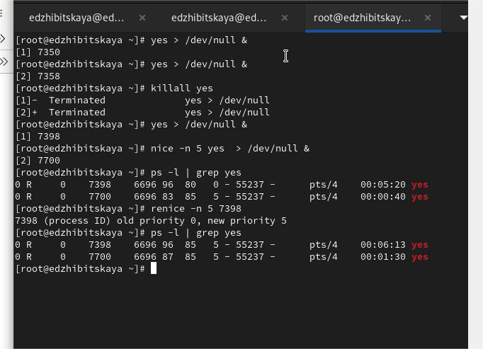{#fig:012 width=70%}

# Ответы на контрольные вопросы

1. Чтобы получить обзор всех текущих заданий оболочки, используем команду jobs(рис. [-@fig:013]).

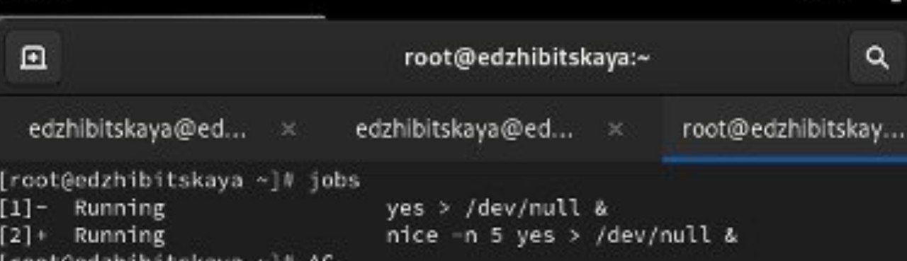{#fig:013 width=70%}
   

2. Чтобы остановить текущее задание оболочки и продолжить его выполнение в фоновом режиме, используем:
      Ctrl + Z
   bg (number)
   

3. Комбинация клавиш для отмены текущего задания оболочки:
      Ctrl + C(рис. [-@fig:014]).

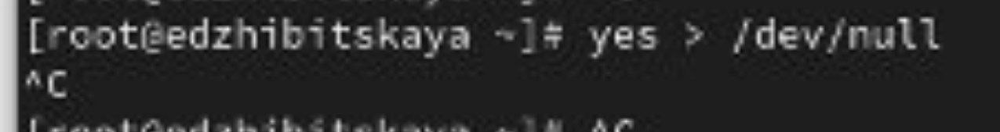{#fig:014 width=70%}
   

4. Чтобы отменить одно из начатых заданий, если у вас нет доступа к оболочке, можно использовать команду kill вместе с идентификатором (PID) процесса. Например:
      kill (process_id)(рис. [-@fig:015]).

{#fig:015 width=70%}
   
   
5.Команда, используемая для отображения отношений между родительскими и дочерними процессами:
      ps fax
   

6. Чтобы изменить приоритет процесса с идентификатором 1234 на более высокий, используем команду:
      renice -n -5 -p 1234
   

7. Чтобы остановить все запущенные процессы dd, можно использовать:
      pkill dd
   
      killall dd (рис. [-@fig:016]).

{#fig:016 width=70%}
   

8. Чтобы остановить команду с именем mycommand, используйте:
      pkill mycommand
   

9. В командной утилите top, чтобы убить процесс, используем клавишу k, затем  PID процесса, который нужно завершить, и  сигнал.

10. Чтобы запустить команду с достаточно высоким приоритетом, не рискуя исчерпать ресурсы для других процессов, используем:
        nice -n 10 command
    

# Выводы

В ходе работы было произведено знакомство с принципами управления процессами, получены навыки и проделаны различные действия по запуску и остановке процессов, заданий.

# Список литературы{.unnumbered}

[ТУИС](https://esystem.rudn.ru/pluginfile.php/2400704/mod_resource/content/4/007-process.pdf)

